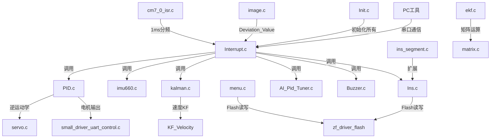

# 轮腿机器人 CYT4BB7 工程上下文描述

> **用途**：新窗口只需接收本文件即可获取完整工程上下文，无需重新阅读全部源码。
> **更新日期**：2026-06-08
> **工程路径**：`wheel_leg_robot_cyt4bb7/`

---

## 1. 项目概述

本项目是一个**两足轮腿机器人**的嵌入式控制系统，基于 Infineon CYT4BB7（Cortex-M7 双核）MCU，运行频率 250MHz。仅使用 CM7_0 核心，CM7_1 为空模板。

机器人采用**闭式五连杆机构**（4 个舵机驱动腿部），双轮差速驱动，具备自平衡、视觉循迹、惯导航迹推算、GPS 导航等多种功能。项目从 TC264/AURIX 平台移植而来，SDK 来自逐飞科技（Seekfree）。

---

## 2. 目录结构

```
wheel_leg_robot_cyt4bb7/
├── project/
│   ├── code/                          # 用户代码（核心）
│   │   ├── ControlPart/               # 控制算法模块
│   │   │   ├── Interrupt.c/h          # 中断调度 + 控制主循环
│   │   │   ├── PID.c/h               # PID算法 + 五连杆逆运动学
│   │   │   ├── Init.c/h              # 硬件初始化序列
│   │   │   ├── servo.c/h             # 舵机PWM控制 + 跳跃状态机
│   │   │   ├── imu660.c/h            # IMU660RA 数据预处理 + Mahony滤波
│   │   │   ├── kalman.c/h            # IMU963RA 卡尔曼滤波 + 速度KF
│   │   │   ├── ekf.c/h               # 扩展卡尔曼滤波（四元数）
│   │   │   ├── matrix.c/h            # 矩阵运算库（EKF用）
│   │   │   ├── Math_Advanced.c/h     # 数学工具函数
│   │   │   ├── small_driver_uart_control.c/h  # 电机驱动UART通信
│   │   │   ├── AI_Pid_Tuner.c/h      # AI无线调参
│   │   │   ├── Buzzer.c/h            # 蜂鸣器反馈
│   │   │   ├── yaokong.c/h           # 遥控（Lora3A22，未启用）
│   │   │   └── zf_device_lora3a22.c/h # Lora模块驱动（逐飞库）
│   │   ├── ins/                       # 惯导模块
│   │   │   ├── Ins.c/h               # 航迹推算 + 航点记录/循迹
│   │   │   └── ins_segment.c/h       # 分段导航 + 事件系统
│   │   ├── Menu/                      # 参数菜单
│   │   │   └── menu.c/h              # 按键菜单 + Flash存储
│   │   └── VersionPart/              # 视觉模块
│   │       ├── image.c/h             # 图像处理 + 元素识别
│   │       └── ips.c/h               # IPS200 LCD调试显示
│   └── user/                          # 入口 + ISR
│       ├── cm7_0_isr.c               # CM7_0 PIT中断入口（1ms→分频）
│       ├── cm7_1_isr.c               # CM7_1 空 ISR
│       └── main_cm7_1.c              # CM7_1 空主函数
├── libraries/                         # SDK库
│   ├── sdk/common/ + tviibh4m/       # Infineon CYT4BB 底层SDK
│   ├── zf_common/                    # 逐飞通用工具
│   ├── zf_components/                # 逐飞组件（无线图传等）
│   ├── zf_device/                    # 逐飞外设驱动（IMU/GNSS/LCD/摄像头等）
│   └── zf_driver/                    # 逐飞底层驱动（UART/SPI/PWM/Flash等）
├── tools/                             # PC端工具
│   ├── pid_auto_tuner.py             # AI自动调参（Claude API + 串口）
│   ├── telemetry_logger.py           # 遥测数据采集GUI（$T帧→CSV）
│   └── ins_logger.py                 # INS路径可视化GUI（$I/$W帧）
├── docs/                              # 文档
│   ├── AI自动调节PID三环方案.md
│   ├── turn_mode7_ins_方案.md
│   ├── 导航方案/                     # GPS导航设计文档
│   └── alignment/                    # 编码整改 + INS移植对齐
└── best_pid_params.json / ai_pid_tuning_history.json  # AI调参历史
```

---

## 3. 硬件平台

| 项目 | 规格 |
|------|------|
| MCU | Infineon CYT4BB7 (Cortex-M7 双核) |
| 主频 | 250MHz (`SYSTEM_CLOCK_250M`) |
| 使用核心 | 仅 CM7_0（CM7_1 为空模板） |
| IMU-1 | IMU660RA (6轴: 陀螺仪+加速度计), SPI接口 |
| IMU-2 | IMU963RA (9轴: 陀螺仪+加速度计+磁力计), SPI接口 |
| 摄像头 | MT9V03X (逐飞总钻风), 80×60 灰度 |
| 显示屏 | IPS200 (SPI, 200×320) |
| TOF测距 | DL1B 激光测距 |
| GNSS | 逐飞GNSS模块 (UART, NMEA协议) |
| 电机驱动 | 小驱动板 (UART_2, 460800 baud) |
| 无线串口 | 逐飞无线串口模块 (AI调参/遥测) |
| Flash | Work Flash 192KB (96页×2KB) |
| 编译器 | IAR 9.40.1 |

---

## 4. 中断调度架构

PIT 定时器产生 1ms 基准中断（`cm7_0_isr.c` → `pit0_ch0_isr`），软件分频为 6 个任务：

| 周期 | 函数 | 主要职责 |
|------|------|----------|
| **1ms** | `Interrupt_1ms()` | yaw积分(angle_Z累加)、Dirchange跟踪 |
| **2ms** | `Interrupt_2ms()` | 陀螺仪PID内环、IMU读取、AI调参处理 |
| **4ms** | `Interrupt_4ms()` | 卡尔曼滤波、角度PID外环、turn_mode切换(0-7) |
| **8ms** | `Interrupt_8ms()` | 单腿控制、舵机平衡、跳跃状态机 |
| **16ms** | `Interrupt_16ms()` | 速度PID、INS坐标更新(航迹推算) |
| **40ms** | `Interrupt_40ms()` | 斑马线超时、yaw漂移补偿(+0.0001)、遥测发送($T/$I/$W交替) |

---

## 5. 控制架构

### 5.1 俯仰(Pitch)三环串级

```
速度环(16ms) → 角度环(4ms) → 陀螺仪环(2ms) → 电机
Target_Speed    Angle_Pitch     Gyro_Pitch
  ↓               ↓               ↓
Speed_Pitch → Angle_Pitch → Gyro_Pitch → Outp_Gyro_Pitch
```

- **速度环**：增量式PID，低通滤波 a=0.5
- **角度环**：位置式PID，低通滤波 a=0.9
- **陀螺仪环**：位置式PID，低通滤波 a=0.5

### 5.2 偏航(Yaw)转向

8 种转向模式 (`turn_mode` 0-7)：

| turn_mode | 名称 | 说明 |
|-----------|------|------|
| 0 | 关闭 | Outp_turn=0 |
| 1 | 逐飞PID | 基础陀螺仪PID转向 |
| 2 | 串级转向 | 角度环+陀螺仪环串级 |
| 3 | 偏航闭环走直线 | yaw角闭环保持直线 |
| 4 | 视觉转向 | Deviation_Value→转向PID |
| 5 | GPS转向 | GPS方位角→desired_yaw→PID |
| 6 | 原地旋转Spin3 | 1080°三圈旋转 |
| 7 | 惯导转向 | yaw_ins→Cascade_angle_Yaw_2 |

### 5.3 翻滚(Roll)稳定

Roll 角度环 + 增量式PID，低通滤波 a=0.5，用于五连杆腿部平衡。

### 5.4 最终电机输出

```c
// control_main() 混合输出
left_duty  = Outp_Gyro_Pitch + Outp_Gyro_Yaw;  // 左轮
right_duty = Outp_Gyro_Pitch - Outp_Gyro_Yaw;   // 右轮
small_driver_set_duty(left_duty, right_duty);    // UART发送
```

---

## 6. 五连杆逆运动学

### 6.1 机构参数

闭式五连杆，尺寸（cm）：L1=6, L2=9, L3=9, L4=6, L5=3.5

```
        L1(前腿上臂)
    ●──────────────●
    │              │
 L4 │              │ L2
    │              │
    ●──── L5 ────●
    │              │
 L4 │              │ L2
    │              │
    ●──────────────●
        L3(后腿上臂)
```

### 6.2 逆运动学求解

`inverseKinematics(X, Y)` → 4个舵机角度 (alpha_L, beta_L, alpha_R, beta_R)

- 前腿角度范围：90°~270°（180°=中位）
- 后腿角度范围：-90°~90°（0°=中位）
- X方向：水平位移（前后）
- Y方向：垂直高度

### 6.3 舵机PWM配置

| 腿 | PWM中值 | PWM通道 | 范围 |
|----|---------|---------|------|
| LF(左前) | 5010 | TCPWM_CH12_P05_3 | 1500-7200 |
| LB(左后) | 3890 | TCPWM_CH21_P08_2 | 1500-7200 |
| RF(右前) | 3950 | TCPWM_CH20_P08_1 | 1500-7200 |
| RB(右后) | 5220 | TCPWM_CH11_P05_2 | 1500-7200 |

每度PWM增量：30.0

### 6.4 跳跃状态机

4阶段：T1=75(抬升) → T2=45(收腿) → T3=30(伸展) → tt=1(缓冲)
跳跃期间：陀螺仪/角度增益降至1/3，X位置镜像1.75×2

---

## 7. IMU 姿态解算

### 7.1 双IMU架构

| IMU | 型号 | 用途 | 滤波算法 |
|-----|------|------|----------|
| IMU660RA | 6轴 | 主姿态源 | Mahony互补滤波 (Kp=2, Ki=0.01) |
| IMU963RA | 9轴 | 辅助/卡尔曼 | 卡尔曼滤波 + 向心补偿 |

### 7.2 IMU660RA 数据处理 (`imu660.c`)

- **零漂校正**：gyro_y -= 2.5, gyro_x -= 1.8, gyro_z 死区[-5,2]=0
- **单位转换**：acc→m/s² (α=0.1 RC滤波), gyro→rps/dps (偏移-19.0/+76.0)
- **Mahony滤波**：四元数更新→欧拉角，halfT=0.001

### 7.3 IMU963RA 卡尔曼滤波 (`kalman.c`)

- **3轴状态**：Xk[3] = {roll, pitch, yaw}
- **初始化**：q=0.0000003, r=0.3, T=4/1000.0f
- **测量模型**：roll=atan(ay/az), pitch=-atan(ax/sqrt(ay²+az²)), yaw=纯积分(K[2]=0)
- **向心补偿**：imu_offset_fwd=0.025m, imu_offset_left=-0.04m, 死区5°/s, 最大±0.5g
- **Yaw自适应R**：旋转时R[1]按yaw_rate²增大(最高100倍)
- **重力补偿**：计算ax_linear, ay_linear

### 7.4 EKF (`ekf.c`)

- 四元数状态向量(4×1)，4×4 Q/P，3×3 R
- dt=0.001f，创新异常值拒绝(r_yz=0.001)
- 作为kalman.c的替代方案

### 7.5 速度卡尔曼滤波 (`kalman.c`)

- **2状态**：[位移, 速度]
- **滑移检测**：SLIP_THRESHOLD=0.2
- **曲率自适应Q/R**：CURVE_THRESHOLD_YAW=0.3 rad/s
- **加速度验证**：ACC_THRESH=5.0f

---

## 8. 电机驱动协议

### 8.1 UART配置

- 串口：UART_2, 460800 baud
- TX：UART2_RX_P10_0, RX：UART2_TX_P10_1

### 8.2 7字节帧协议

| 字节 | 内容 |
|------|------|
| 0 | 0xA5 (帧头) |
| 1 | 功能码 (0x01=设duty, 0x02=速度数据) |
| 2-3 | 数据1 (int16 高+低字节) |
| 4-5 | 数据2 (int16 高+低字节) |
| 6 | 校验和 |

### 8.3 关键函数

- `small_driver_set_duty(left, right)`：发送duty命令(-10000~10000，负=反转)，**左右duty均取反后发送**
- `small_driver_get_speed()`：请求速度数据（驱动板10ms间隔发送）
- `uart_control_callback()`：解析接收的编码器速度数据

---

## 9. 惯导系统 (INS)

### 9.1 基础航迹推算 (`Ins.c`)

- **坐标更新**（16ms周期）：dx=speed×0.016×cos(yaw), dy=speed×0.016×sin(yaw)
- **航点管理**：最多30个航点，double精度(64位)
- **Flash存储**：Page 2=航点坐标, Page 12=航点数n
- **模式**：
  - ins_mode=0：记录模式（KEY_3=记录, KEY_2=存Flash, KEY_1=切模式1）
  - ins_mode=1：循迹模式（从Flash加载，顺序导航，到达阈值dis<20）
  - ins_mode=2：分段编辑
  - ins_mode=3：分段导航

### 9.2 分段导航 (`ins_segment.c`)

- **段池**：8段×252字节 ≈ 2KB RAM
- **每段**：最多15航点 + 元数据(wp_count, index, target_speed, arrival_threshold, arrival_behavior, custom_event_id)
- **到达行为**：STOP(0), NEXT(1), RETURN(2), CUSTOM(3)
- **事件系统**：`ins_seg_event_register()` 注册回调
- **Flash布局**：Page 49=元数据(magic=0x5345474D="SEGM"), Page 50+idx=各段数据

---

## 10. 视觉处理

### 10.1 图像参数

- 分辨率：80×60 (Image_X=80, Image_Y=60)
- 增益：Image_Gain=32, 曝光：Image_EpTime=4000

### 10.2 元素识别

| 元素 | 宏定义 | 识别标志 | 速度设定 |
|------|--------|----------|----------|
| 直道 | Straightaway(2) | ✓ | 1000 |
| 左/右弯 | L/R_Turn(3/4) | ✓ | 1000 |
| 左/右环岛 | L/R_Circle(5/6) | ✓(5态) | 1200-1400 |
| 十字 | Cross(7) | ✓(3态) | 1500 |
| 斑马线 | Zebra(8) | ✓ | 0(停车) |
| 坡道 | Ramp(9) | ✗ | - |
| 障碍 | Barrier(11) | ✓ | 200 |
| 跳跃 | Jump_State(20) | ✓ | - |
| 单边桥 | Single_State(21) | ✓ | - |

### 10.3 关键输出

- `Deviation_Value`：主转向误差，送入转向PID
- `Element_State`：当前识别的元素类型
- `Stop_Flag`：视觉停车信号
- `Z_Yaw`：斑马线yaw修正

---

## 11. 遥测协议

40ms 周期交替发送三种帧（115200 baud 无线串口）：

### $T 帧（遥测数据，20字段）
```
$T,tick,pitch,roll,yaw,gx,gy,gz,outp_turn,outp_gyro_pitch,
   target_yaw,turn_mode,deviation,kf_pitch,kf_roll,
   motor_l,motor_r,ax_linear,ay_linear,angle_Z
```

### $I 帧（INS数据，8字段）
```
$I,x,y,ins_mode,dis_ins,yaw_ins,n,target,flag_save
```

### $W 帧（航点保存通知，4字段）
```
$W,index,x,y,n
```

---

## 12. AI 自动调参

### 12.1 单片机端 (`AI_Pid_Tuner.c`)

- **发送**：JSON格式 `{"pitch":...,"speed_out":...,"angle_out":...,"gyro_out":...,"motor_speed":...,"flag_main":...}`
- **接收**：`P:kp_a,ki_a,kd_a,kp_g,ki_g,kd_g,kp_s,ki_s,kd_s,offset_roll` (10参数)
- **更新后**：复位PID积分项防windup冲击，发JSON确认

### 12.2 PC端 (`tools/pid_auto_tuner.py`)

- 串口采集数据 → Claude API分析 → 自动计算新PID参数 → 串口下发
- 三环串级：速度环(外)→角度环(中)→陀螺仪环(内)

---

## 13. 参数菜单与Flash存储

### 13.1 菜单系统 (`menu.c`)

- 按键状态机，多页参数调整
- `store_or_read_DATA(WRITE/READ)`：Flash读写所有参数
- 默认显示 `IPS200_Show1()`：电机速度、yaw/pitch角、INS航点信息

### 13.2 Flash Page 1 布局（93个uint32）

| 索引 | 内容 |
|------|------|
| [0-5] | pitch/roll偏移, erect_Gyro_Pitch[4] |
| [6-9] | erect_Angle_Pitch[4] |
| [10-12] | Target_Speed, Target_height, Show_Flag |
| [13-20] | erect_Gyro_Yaw[4], erect_Angle_Yaw[4] |
| [21-24] | erect_Angle_Yaw_2[4] |
| [26-32] | Target_Yaw, P_Value_L[0-6] |
| [33-36] | pwmLF/LB/RF/RB |
| [37-48] | erect_Inc_X/Y/Roll[3]各, erect_yawan[3] |
| [17-22] | ins_open, ins_mode, erect_Angle_Yaw_2 (菜单页1) |

### 13.3 Flash分区总览

| 页 | 用途 |
|----|------|
| 1 | PID参数+系统参数（menu.c） |
| 2 | INS航点坐标（Ins.c） |
| 12 | INS航点数n（Ins.c） |
| 49 | 分段导航元数据（ins_segment.c） |
| 50+idx | 各段导航数据（ins_segment.c） |

---

## 14. 关键数据结构

### 14.1 Center_struct (`Interrupt.h`)

```c
typedef struct {
    float Outp_Gyro_Pitch, Angle_Pitch, Speed_Pitch;  // 俯仰三环
    float Outp_Gyro_Roll, Angle_Roll;                   // 翻滚
    float Outp_Gyro_Yaw, Angle_Yaw;                     // 偏航
    float Outp_turn;                                     // 转向输出
    int   Encoder_Left, Encoder_Right;                   // 编码器
    float Target_Speed, Target_height;                   // 目标速度/高度
} Center_struct;
extern Center_struct Yao;  // 主控制结构体
```

### 14.2 PID_ERECT (`PID.h`)

包含所有PID参数数组：erect_Gyro_Pitch[4], erect_Angle_Pitch[4], erect_Speed_Pitch[4], erect_turn[4], erect_Angle_Yaw[4], erect_Angle_Yaw_2[4], erect_Angle_Yaw_3[4], erect_Inc_X[3], erect_Inc_Y[3], erect_Inc_Roll[3], erect_yawan[3] 等

PID数组格式：4元素={KP, KP2/KI, KD, integral_limit} 或 3元素={KP, KI, KD}

### 14.3 当前PID参数值

| 参数组 | 值 |
|--------|-----|
| erect_Gyro_Pitch | {0.82, 0, 0, 0} |
| erect_Angle_Pitch | {250, 0, 20, 0} |
| erect_Angle_Yaw_2 | {1.7, 0, 0.8, 0} |
| erect_Inc_X | {2.7, 0, 0, 0} |

---

## 15. 全局变量速查

| 变量 | 类型 | 文件 | 说明 |
|------|------|------|------|
| `Yao` | Center_struct | Interrupt | 主控制输出 |
| `angle_Z` | float | Interrupt | 连续累积yaw角 |
| `turn_mode` | uint8 | Interrupt | 转向模式(0-7) |
| `flag_stop` | uint8 | Interrupt | 停车标志 |
| `ins_open` | uint8 | Interrupt | 惯导转向开关 |
| `flag_ai_open` | uint16 | AI_Pid_Tuner | AI调参开关 |
| `flag_main` | uint8 | Interrupt | 保护停转标志 |
| `telemetry_enable` | uint8 | Interrupt | 遥测发送开关 |
| `ins_telemetry_enable` | uint8 | Interrupt | INS遥测开关 |
| `calibrate_state/offset/count/sum` | - | Interrupt | IMU校准(CALIBRATE_SAMPLES=500) |
| `steer_vision_target_yaw_deg` | float | Interrupt | 视觉转向目标角 |
| `steer_gps_target_bearing_deg` | float | Interrupt | GPS转向目标方位角 |
| `desired_yaw` | float | Interrupt | 期望yaw角 |
| `Deviation_Value` | float | image | 视觉转向误差 |
| `Element_State` | uint8 | image | 当前元素类型 |
| `cod_realtime` | Coordinates | Ins | 实时坐标 |
| `dis_ins` | double | Ins | 到目标距离 |
| `yaw_ins` | double | Ins | 到目标方位角(0~360°) |
| `imu660ra` | imu660_struct | imu660 | IMU660RA数据 |
| `imu` | imu963ra_struct | kalman | IMU963RA数据 |
| `vel_kf` | KF_Velocity | kalman | 速度卡尔曼滤波 |
| `menu_open` | uint8 | menu | 菜单开关 |
| `flag_track` | uint8 | menu | 循迹标志 |

---

## 16. 初始化序列 (`Init.c`)

```
clock(250M) → debug_uart → key → wireless_uart → dl1b(TOF) → imu660ra →
adc(电池) → ips200(LCD) → flash → Kalman滤波初始化 → PID参数初始化 →
menu/flash读取 → servo_init → EKF_Init → small_driver_uart_init
```

- IMU偏移默认值：pitch=19.39, roll=6.39
- TOF滑动窗口滤波：WINDOW_SIZE=30, OFFSET_MM=10
- 卡尔曼初始化：q=0.0000003, r=0.3, T=4/1000.0f

---

## 17. 编码问题

项目存在 GBK/UTF-8 编码混乱问题（从 TC264 移植时产生）：

- **31个文件**：干净UTF-8，无需转码
- **8个文件**：编码混乱需修复（PID.c/h, Init.c, Interrupt.c, Ins.c/h, lora3a22.c/h）
- 详细修复方案见 `docs/alignment/CONSTRAINTS_ENCODING_AND_COMMENTS.md`
- 代码中存在未解决的 git merge conflict 标记

---

## 18. GPS导航（规划中）

GPS导航功能尚未实现，已有完整设计文档：

- **架构**：应用层(导航状态机) → 桥接层(双缓冲) → 中断层(turn_mode==5 PID) → 驱动层
- **模块**：gps_waypoint(航点CRUD+Flash), gps_nav(状态机+方位角计算), gps_calibration(IMU-GPS偏移校准)
- **校准**：当前采用"起点约束法"（开机停在第一航点面朝下一航点）
- **Flash**：Page 50/51 存储GPS航点
- 详见 `docs/导航方案/` 目录

---

## 19. PC端工具

| 工具 | 功能 | 依赖 |
|------|------|------|
| `pid_auto_tuner.py` | AI自动调参GUI | pyserial, anthropic, numpy |
| `telemetry_logger.py` | $T帧遥测采集→CSV | pyserial, tkinter |
| `ins_logger.py` | $I/$W帧INS路径可视化 | pyserial, tkinter, matplotlib |

---

## 20. 模块依赖关系



---

## 21. 快速定位指南

| 需求 | 查看文件 |
|------|----------|
| 修改PID参数 | `PID.c/h` + `menu.c`(Flash存储) |
| 修改控制周期 | `Interrupt.c` + `cm7_0_isr.c` |
| 添加新转向模式 | `Interrupt.c`(Interrupt_4ms) + `Interrupt.h`(声明) |
| 修改IMU滤波 | `imu660.c`(Mahony) 或 `kalman.c`(卡尔曼) |
| 修改腿部运动 | `PID.c`(Adapt_Terrain) + `servo.c`(PWM) |
| 修改视觉识别 | `image.c` + `ips.c`(调试显示) |
| 修改导航逻辑 | `Ins.c`(基础) + `ins_segment.c`(分段) |
| 修改电机协议 | `small_driver_uart_control.c/h` |
| 修改遥测格式 | `Interrupt.c`(Interrupt_40ms) + `telemetry_logger.py` |
| 修改Flash布局 | `menu.c`(Page1) + `Ins.c`(Page2/12) + `ins_segment.c`(Page49+) |
| 添加GPS导航 | `docs/导航方案/` + 新建 gps_*.c/h |
| 修复编码问题 | `docs/alignment/CONSTRAINTS_ENCODING_AND_COMMENTS.md` |
