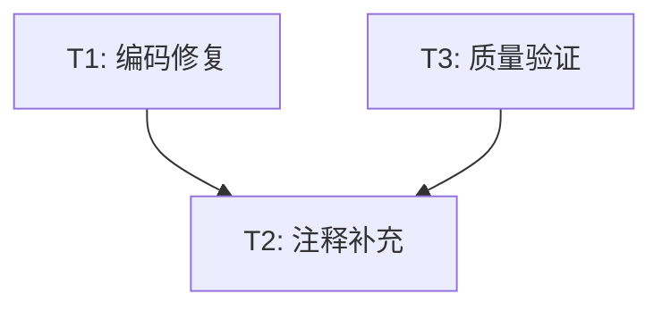

# 编码整改与注释补充 — 任务集

> 项目：轮腿机器人 CYT4BB7
> 范围：`project/code/` 下所有子文件夹
> 约束文件：`docs/alignment/CONSTRAINTS_ENCODING_AND_COMMENTS.md`
> 日期：2026-06-05

---

## 依赖关系



- T1 完成后才能开始 T2（编码修复是前提）
- T2 全部完成后执行 T3

---

## T1: 编码修复（8 个文件）

> 将编码混乱的文件统一转为 GB2312，修复乱码注释

### T1.1 — ControlPart/PID.c 编码修复

- **文件**：`project/code/ControlPart/PID.c`
- **当前编码**：混合编码（非 UTF-8 非 GBK）
- **目标编码**：GB2312
- **操作步骤**：
  1. 用 GBK 编码尝试读取文件内容
  2. 识别乱码注释区域（行 22-50 的 PID 参数注释、行 44-77 的各环参数注释）
  3. 根据上下文推断乱码原意，重写为正确中文：
     - `// ??????1,0,0,0` → `// 陀螺仪比例: 1,0,0,0`
     - `// ??????400,0,0,0` → `// 角度比例: 400,0,0,0`
     - `// 违动学坂?` → `// 运动学参数`
     - `// 转坑?` → `// 转向参数`
     - `// 翻滚角平?` → `// 翻滚角平衡`
     - `// 俯仰角平?` → `// 俯仰角平衡`
  4. 以 GB2312 编码写回文件
- **验证**：重新以 GB2312 读取，确认中文显示正确
- **复杂度**：高（28.6KB，大量乱码需还原）
- **注意**：不修改任何 PID 参数值和代码逻辑

### T1.2 — ControlPart/PID.h 编码修复

- **文件**：`project/code/ControlPart/PID.h`
- **当前编码**：混合编码
- **目标编码**：GB2312
- **操作步骤**：同 T1.1
- **验证**：重新以 GB2312 读取确认正确
- **复杂度**：中（4.4KB）

### T1.3 — ControlPart/Init.c 编码修复

- **文件**：`project/code/ControlPart/Init.c`
- **当前编码**：UTF-8（中文为双重编码乱码）
- **目标编码**：GB2312
- **操作步骤**：
  1. 以 UTF-8 读取文件
  2. 识别乱码区域：
     - 行 25：`閫傚綋鐨勫欢鏃跺悗鍦ㄨ繘琛屽垵濮嬪寲` → `// 适当的延时后再进行初始化`
     - 行 28：`铚傞福鍣?` → `// 蜂鸣器`
     - 行 30：`鎸夐` → `// 按键`
     - 行 31：`鏃犵嚎涓插彛` → `// 无线串口`
     - 行 34：`闄€铻轰` → `// 陀螺仪`
     - 行 36：`鐢垫` → `// 电压`
     - 行 37：`鎬婚捇椋?` → `// 摄像头`
     - 行 38：`鍒濆鍖栦覆` → `// 初始化串口`
  3. 将乱码注释替换为正确中文
  4. 以 GB2312 编码写回
- **验证**：重新以 GB2312 读取确认
- **复杂度**：中（7.9KB）

### T1.4 — ControlPart/Interrupt.c 编码修复

- **文件**：`project/code/ControlPart/Interrupt.c`
- **当前编码**：UTF-8（中文为双重编码乱码）
- **目标编码**：GB2312
- **操作步骤**：
  1. 以 UTF-8 读取文件
  2. 识别并修复所有乱码区域（行 32-49 的变量注释大量乱码）
  3. 参考代码上下文还原注释：
     - `瑙掑害鎺у埗锛岀伊鍝ュ紑` → `// 0:角度控制，灯亮开`
     - `PWM鎺у埗锛岄€氶鏂规` → `// 1:PWM控制，递进方案`
     - `鍏抽` → `// 关闭`
     - `閫氶鍙孭D杞` → `// 递进PD转`
     - `涓茬骇杞` → `// 串联转`
     - `yaw瑙掗棴鐜拌蛋鐩寸` → `// yaw角闭环走直线`
     - `鍏抽棴妯＄硦` → `// 关闭模糊`
     - `寮€鍚ā绯` → `// 开启模糊`
     - `鍏抽棴鑿滃崟` → `// 关闭菜单`
     - `鎵撳紑鑿滃崟` → `// 打开菜单`
  4. 以 GB2312 编码写回
- **验证**：重新以 GB2312 读取确认
- **复杂度**：高（17.3KB，大量乱码变量注释）

### T1.5 — ControlPart/zf_device_lora3a22.c 编码修复

- **文件**：`project/code/ControlPart/zf_device_lora3a22.c`
- **当前编码**：GBK
- **目标编码**：GB2312
- **操作步骤**：
  1. 以 GBK 读取文件
  2. 直接以 GB2312 写回（GBK → GB2312 兼容转换）
- **验证**：以 GB2312 读取确认中文正常
- **约束**：**只转编码，不修改任何注释内容**（逐飞科技第三方库）
- **复杂度**：低（4.2KB，纯转码）

### T1.6 — ControlPart/zf_device_lora3a22.h 编码修复

- **文件**：`project/code/ControlPart/zf_device_lora3a22.h`
- **当前编码**：GBK
- **目标编码**：GB2312
- **操作步骤**：同 T1.5
- **约束**：**只转编码，不修改任何注释内容**
- **复杂度**：低（3.1KB）

### T1.7 — ins/Ins.c 编码修复

- **文件**：`project/code/ins/Ins.c`
- **当前编码**：GBK
- **目标编码**：GB2312
- **操作步骤**：同 T1.5
- **验证**：以 GB2312 读取确认中文正常
- **复杂度**：低（6.8KB，纯转码）

### T1.8 — ins/Ins.h 编码修复

- **文件**：`project/code/ins/Ins.h`
- **当前编码**：GBK
- **目标编码**：GB2312
- **操作步骤**：同 T1.5
- **复杂度**：低（0.8KB，纯转码）

---

## T2: 注释补充（39 个文件）

> 对所有文件补充中文注释，包括 A 类（UTF-8 保持）和 B 类（已转 GB2312）

### T2.1 — ControlPart/PID.c 注释补充

- **文件**：`project/code/ControlPart/PID.c`（已由 T1.1 修复编码）
- **当前注释状况**：部分函数无注释，PID 参数数组缺少详细说明
- **需补充**：
  1. 文件头模块说明（PID 三环控制：俯仰/翻滚/偏航 + 运动学补偿）
  2. 各 PID 参数数组的详细注释：
     - `erect_Gyro_Pitch[4]` → 陀螺仪微分增益 [Kd, Kd2, Kd3, Kd4]
     - `erect_Angle_Pitch[4]` → 角度比例增益 [Kp, Kp2, Kp3, Kp4]
     - `erect_Speed_Pitch[4]` → 速度积分增益 [Ki, Ki2, Ki3, Ki4]
     - 同理补充 Roll/Yaw/Inc/Km 等数组
  3. `Spin3_Start()` 函数注释
  4. `steer_wrap_deg180()` 函数注释
  5. 主控制循环函数（如有）的步骤注释
  6. 运动学逆解相关计算步骤注释
- **复杂度**：高（28.6KB，核心控制文件）
- **参考**：`small_driver_uart_control.c` 的注释风格

### T2.2 — ControlPart/PID.h 注释补充

- **文件**：`project/code/ControlPart/PID.h`
- **需补充**：
  1. 各结构体字段的中文说明
  2. 外部变量声明的作用说明
  3. 函数声明的功能简介
- **复杂度**：中（4.4KB）

### T2.3 — ControlPart/Interrupt.c 注释补充

- **文件**：`project/code/ControlPart/Interrupt.c`（已由 T1.4 修复编码）
- **需补充**：
  1. 各中断服务函数功能说明
  2. 控制模式变量详细注释（steer_control_mode, turn_mode, fuzzy_mode 各值含义）
  3. 状态标志位注释（menu_open, flag_yawan, flag_stop）
  4. 定时器中断中的控制流程步骤注释
- **复杂度**：高（17.3KB）

### T2.4 — ControlPart/Interrupt.h 注释补充

- **文件**：`project/code/ControlPart/Interrupt.h`
- **需补充**：结构体字段注释、外部变量说明
- **复杂度**：中（1.8KB）

### T2.5 — ControlPart/Init.c 注释补充

- **文件**：`project/code/ControlPart/Init.c`（已由 T1.3 修复编码）
- **需补充**：
  1. `Init_All()` 各初始化步骤说明
  2. 各外设初始化的用途注释
- **复杂度**：中（7.9KB）

### T2.6 — ControlPart/Init.h 注释补充

- **文件**：`project/code/ControlPart/Init.h`
- **复杂度**：低（0.3KB）

### T2.7 — ControlPart/ekf.c 注释补充

- **文件**：`project/code/ControlPart/ekf.c`
- **当前状况**：几乎无注释
- **需补充**：
  1. EKF（扩展卡尔曼滤波）算法步骤注释
  2. 预测步骤、更新步骤说明
  3. 状态向量和观测向量说明
  4. 雅可比矩阵计算注释
- **复杂度**：中（4.9KB）

### T2.8 — ControlPart/ekf.h 注释补充

- **文件**：`project/code/ControlPart/ekf.h`
- **需补充**：结构体字段说明、宏定义含义
- **复杂度**：低（0.5KB）

### T2.9 — ControlPart/matrix.c 注释补充

- **文件**：`project/code/ControlPart/matrix.c`
- **当前状况**：几乎无注释
- **需补充**：
  1. 各矩阵运算函数功能说明
  2. 矩阵乘法、求逆、转置等函数注释
- **复杂度**：中（6.3KB）

### T2.10 — ControlPart/matrix.h 注释补充

- **文件**：`project/code/ControlPart/matrix.h`
- **需补充**：矩阵结构体字段、函数声明注释
- **复杂度**：低（1.5KB）

### T2.11 — ControlPart/kalman.c 注释补充

- **文件**：`project/code/ControlPart/kalman.c`
- **需补充**：
  1. 卡尔曼滤波算法步骤注释
  2. 姿态解算流程说明
  3. IMU 数据融合过程
- **复杂度**：高（14.5KB）

### T2.12 — ControlPart/kalman.h 注释补充

- **文件**：`project/code/ControlPart/kalman.h`
- **需补充**：结构体字段说明
- **复杂度**：中（3.2KB）

### T2.13 — ControlPart/Math_Advanced.c 注释补充

- **文件**：`project/code/ControlPart/Math_Advanced.c`
- **需补充**：各数学工具函数功能说明
- **复杂度**：中（11.9KB）

### T2.14 — ControlPart/Math_Advanced.h 注释补充

- **文件**：`project/code/ControlPart/Math_Advanced.h`
- **复杂度**：低（1.7KB）

### T2.15 — ControlPart/servo.c 注释补充

- **文件**：`project/code/ControlPart/servo.c`
- **需补充**：舵机控制函数注释、PWM 配置说明
- **复杂度**：中（10.8KB）

### T2.16 — ControlPart/servo.h 注释补充

- **文件**：`project/code/ControlPart/servo.h`
- **复杂度**：低（0.9KB）

### T2.17 — ControlPart/imu660.c 注释补充

- **文件**：`project/code/ControlPart/imu660.c`
- **需补充**：IMU660RA 初始化、数据读取函数注释
- **复杂度**：中（5.3KB）

### T2.18 — ControlPart/imu660.h 注释补充

- **文件**：`project/code/ControlPart/imu660.h`
- **复杂度**：低（1.0KB）

### T2.19 — ControlPart/Buzzer.c 注释补充

- **文件**：`project/code/ControlPart/Buzzer.c`
- **需补充**：蜂鸣器控制函数注释
- **复杂度**：低（6.1KB）

### T2.20 — ControlPart/Buzzer.h 注释补充

- **文件**：`project/code/ControlPart/Buzzer.h`
- **复杂度**：低（0.3KB）

### T2.21 — ControlPart/small_driver_uart_control.c 注释补充

- **文件**：`project/code/ControlPart/small_driver_uart_control.c`
- **当前状况**：注释已较完善，只需检查补充遗漏
- **复杂度**：低（9.4KB）

### T2.22 — ControlPart/small_driver_uart_control.h 注释补充

- **文件**：`project/code/ControlPart/small_driver_uart_control.h`
- **复杂度**：低（1.2KB）

### T2.23 — ControlPart/yaokong.c 注释补充

- **文件**：`project/code/ControlPart/yaokong.c`
- **需补充**：遥控数据处理函数注释
- **复杂度**：低（1.1KB）

### T2.24 — ControlPart/yaokong.h 注释补充

- **文件**：`project/code/ControlPart/yaokong.h`
- **复杂度**：低（0.3KB）

### T2.25 — ins/Ins.c 注释补充

- **文件**：`project/code/ins/Ins.c`（已由 T1.7 转码）
- **需补充**：INS 整合接口函数注释
- **复杂度**：中（6.8KB）

### T2.26 — ins/Ins.h 注释补充

- **文件**：`project/code/ins/Ins.h`（已由 T1.8 转码）
- **复杂度**：低（0.8KB）

### T2.27 — ins/ins_core.c 注释补充

- **文件**：`project/code/ins/ins_core.c`
- **当前状况**：注释已较好，检查补充
- **复杂度**：低（4.1KB）

### T2.28 — ins/ins_core.h 注释补充

- **文件**：`project/code/ins/ins_core.h`
- **复杂度**：低（1.8KB）

### T2.29 — ins/ins_interface.c 注释补充

- **文件**：`project/code/ins/ins_interface.c`
- **当前状况**：注释已较好，检查补充
- **复杂度**：低（5.4KB）

### T2.30 — ins/ins_interface.h 注释补充

- **文件**：`project/code/ins/ins_interface.h`
- **复杂度**：低（5.8KB）

### T2.31 — ins/ins_track.c 注释补充

- **文件**：`project/code/ins/ins_track.c`
- **需补充**：Pure Pursuit 循迹算法步骤注释
- **复杂度**：中（19.7KB）

### T2.32 — ins/ins_track.h 注释补充

- **文件**：`project/code/ins/ins_track.h`
- **复杂度**：低（2.5KB）

### T2.33 — Menu/menu.c 注释补充

- **文件**：`project/code/Menu/menu.c`
- **需补充**：菜单系统功能注释、各菜单项说明
- **复杂度**：高（59KB，大文件）

- **注意**：此文件最大，可分批处理

### T2.34 — Menu/menu.h 注释补充

- **文件**：`project/code/Menu/menu.h`
- **需补充**：菜单结构体、函数声明注释
- **复杂度**：低（2.3KB）

### T2.35 — VersionPart/image.c 注释补充

- **文件**：`project/code/VersionPart/image.c`
- **特殊处理**：仅补充文件头部模块说明和关键函数注释
- **禁止**：不对图像点阵数据数组添加注释
- **复杂度**：低（仅头部，跳过 405KB 数据）

### T2.36 — VersionPart/image.h 注释补充

- **文件**：`project/code/VersionPart/image.h`
- **需补充**：图像处理函数声明注释
- **复杂度**：低（3.5KB）

### T2.37 — VersionPart/ips.c 注释补充

- **文件**：`project/code/VersionPart/ips.c`
- **需补充**：IPS 显示函数注释
- **复杂度**：中（34.6KB）

### T2.38 — VersionPart/ips.h 注释补充

- **文件**：`project/code/VersionPart/ips.h`
- **复杂度**：低（3.4KB）

### T2.39 — ControlPart/zf_device_lora3a22.c/h 注释

- **文件**：`zf_device_lora3a22.c` + `zf_device_lora3a22.h`
- **约束**：**不补充注释**（第三方库，只转编码）
- **操作**：跳过
- **复杂度**：无

---

## T3: 质量验证

### T3.1 — 编码验证

- 对 T1 修改的 8 个文件，以 GB2312 编码读取，确认无乱码
- 对 A 类文件，以 UTF-8 读取，确认未受影响

### T3.2 — 注释完整性验证

- 检查所有 `.c` 文件：每个函数是否有注释头
- 检查所有 `.h` 文件：结构体字段和函数声明是否有注释

### T3.3 — 编译安全验证

- 检查 `/* */` 配对正确
- 检查 `//` 行末无断行问题
- 确认无语法错误引入

---

## 执行优先级

```
T1.5 + T1.6 + T1.7 + T1.8（纯转码，无风险，先执行）
         ↓
T1.1 + T1.2 + T1.3 + T1.4（乱码修复，需语义推断）
         ↓
T2.7 + T2.8 + T2.9 + T2.10（ekf + matrix，几乎无注释，影响大）
         ↓
T2.1 + T2.2 + T2.3 + T2.4（PID + Interrupt，核心控制）
         ↓
T2.11 ~ T2.38（其余模块按模块顺序）
         ↓
T3（质量验证）
```

---

## 排除项

| 文件 | 原因 |
|------|------|
| `VersionPart/image.c` 数据部分 | 405KB 图像点阵，不做注释 |
| `本文件夹作用.txt` | 非代码文件 |
| `ControlPart/zf_device_lora3a22.c/h` 注释 | 第三方库，不补充注释 |
