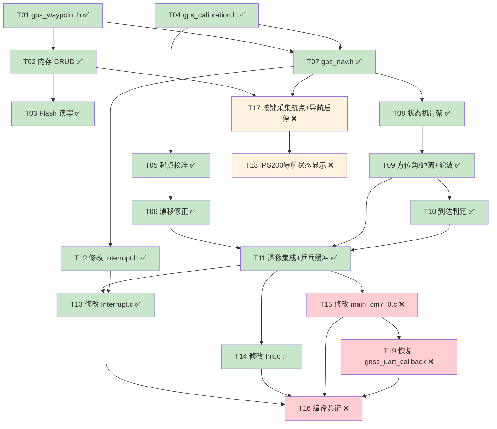

# TASKS — GPS 导航框架（基于工程实际优化版）

> 6A 流程 · Atomize 阶段产出
> 依赖文档：`ALIGNMENT_GPS_NAVIGATION.md` + `GPS导航框架.md`（Architect 产出）
> **优化说明**：基于对工程代码的逐文件审查，标注各任务的实际完成状态，修正偏差，补充遗漏

---

## 任务总览

| ID  | 任务名称                                     | 模块        | 复杂度 | 依赖          | 预估耗时 | 状态       |
| --- | -------------------------------------------- | ----------- | ------ | ------------- | -------- | ---------- |
| T01 | 创建 gps_waypoint.h 头文件                   | M1 航点     | ★☆☆ | 无            | 15min    | ✅ 已完成  |
| T02 | 实现 gps_waypoint.c — 内存 CRUD             | M1 航点     | ★☆☆ | T01           | 20min    | ✅ 已完成  |
| T03 | 实现 gps_waypoint.c — Flash 读写            | M1 航点     | ★★☆ | T02           | 30min    | ✅ 已完成  |
| T04 | 创建 gps_calibration.h 头文件                | M3 校准     | ★☆☆ | 无            | 10min    | ✅ 已完成  |
| T05 | 实现 gps_calibration.c — 起点校准           | M3 校准     | ★★☆ | T04           | 25min    | ✅ 已完成  |
| T06 | 实现 gps_calibration.c — 漂移修正           | M3 校准     | ★★☆ | T04, T05      | 25min    | ✅ 已完成  |
| T07 | 创建 gps_nav.h 头文件                        | M2 导航     | ★☆☆ | T01, T04      | 15min    | ✅ 已完成  |
| T08 | 实现 gps_nav.c — 状态机骨架                 | M2 导航     | ★★☆ | T07           | 30min    | ✅ 已完成  |
| T09 | 实现 gps_nav.c — 方位角/距离计算 + 环形滤波 | M2 导航     | ★★☆ | T08           | 25min    | ✅ 已完成  |
| T10 | 实现 gps_nav.c — 到达判定（滞后）           | M2 导航     | ★☆☆ | T08, T09      | 15min    | ✅ 已完成  |
| T11 | 实现 gps_nav.c — 漂移修正集成 + 乒乓缓冲提交  | M2 导航     | ★★☆ | T06, T09, T10 | 20min    | ✅ 已完成  |
| T12 | 修改 Interrupt.h — 替换 GPS volatile 变量   | M4 ISR      | ★☆☆ | T07           | 10min    | ✅ 已完成  |
| T13 | 修改 Interrupt.c — turn_mode==5 读乒乓缓冲    | M4 ISR      | ★★☆ | T11, T12      | 20min    | ✅ 已完成  |
| T14 | 修改 Init.c — 启用 gnss_init + gps_nav_init | 集成        | ★☆☆ | T11           | 10min    | ✅ 已完成  |
| T15 | 修改 main_cm7_0.c — CM7_0主循环添加导航处理  | 集成        | ★★☆ | T11           | 20min    | ❌ 未完成  |
| T16 | 编译验证 + 串口调试输出                      | 验证        | ★★☆ | T13, T14, T15 | 30min    | ❌ 未完成  |
| T17 | 实现按键采集航点 + 导航启停控制              | M5 按键交互 | ★★☆ | T02, T07      | 25min    | ❌ 未完成  |
| T18 | 实现 IPS200 屏幕导航状态显示                 | M6 显示     | ★★☆ | T17           | 20min    | ❌ 未完成  |
| T19 | 恢复 cm7_0_isr.c 中 gnss_uart_callback      | M4 ISR      | ★☆☆ | T15           | 10min    | ❌ 未完成  |

**总计：19 个任务，T01-T14 已完成，T15-T19 待完成，预估剩余 ~1.75 小时**

---

## 依赖关系图



> 🟢 绿色 = 已完成 | 🔴 红色 = 集成阻塞项 | 🟡 黄色 = 功能增强项

### 关键路径（剩余）

```
T15 → T19 → T16
```

**剩余关键路径长度**：3 个任务，预估 ~60min

### 可并行分支

| 分支        | 任务              | 可与谁并行                               | 状态   |
| ----------- | ----------------- | ---------------------------------------- | ------ |
| A: 航点模块 | T01 → T02 → T03 | 与分支 B（校准模块）并行                 | ✅ 完成 |
| B: 校准模块 | T04 → T05 → T06 | 与分支 A（航点模块）并行                 | ✅ 完成 |
| C: ISR 修改 | T12               | 与 T08~T11 并行（仅改头文件声明）        | ✅ 完成 |
| D: 主循环集成 | T15 → T19       | 关键路径，阻塞 T16                       | ❌ 待做 |
| E: 按键交互 | T17 → T18        | 与 T15~T16 并行（依赖 T02+T07 已满足）  | ❌ 待做 |

---

## 已完成任务审查（T01-T14）

> 以下任务代码已存在于工程中，此处记录实际实现与原始规格的差异，供后续维护参考。

### T01: 创建 gps_waypoint.h 头文件 ✅

**实际实现**：`project/code/GpsNav/gps_waypoint.h`
- `gps_waypoint_t`：lat/lng 双精度，与规格一致
- `gps_waypoint_set_t`：数组 40 个，count/current_index/valid，与规格一致
- Flash 页宏：`GPS_WP_FLASH_PAGE_DATA=50`, `GPS_WP_FLASH_PAGE_META=51`, `GPS_WP_MAGIC=0xA5`
- `extern gps_waypoint_set_t gps_wp_set` — 全局实例声明
- **偏差**：无显著偏差

### T02: 实现 gps_waypoint.c — 内存 CRUD ✅

**实际实现**：`project/code/GpsNav/gps_waypoint.c`
- `gps_wp_init`：清零 gps_wp_set
- `gps_wp_add`：含 lat/lng 范围校验（-90~90, -180~180）
- `gps_wp_clear`：清零 count 和 current_index
- `gps_wp_current`：返回当前航点指针
- `gps_wp_next`：前进并返回下一航点
- `gps_wp_advance`：仅前进索引，返回是否成功
- `gps_wp_get_count` / `gps_wp_get_current_index`：访问器
- **偏差**：无显著偏差

### T03: 实现 gps_waypoint.c — Flash 读写 ✅

**实际实现**：`project/code/GpsNav/gps_waypoint.c`
- `gps_wp_save_to_flash`：先写 page 50（数据），再写 page 51（元数据含 magic+checksum）
- `gps_wp_load_from_flash`：先验证 page 51 的 magic 和 checksum，再读 page 50
- `double_to_two_uint32` / `two_uint32_to_double`：double↔双 uint32 辅助函数
- **偏差**：无显著偏差，Flash 双页策略与规格一致

### T04: 创建 gps_calibration.h 头文件 ✅

**实际实现**：`project/code/GpsNav/gps_calibration.h`
- 宏：`GPS_DRIFT_CORRECTION_ALPHA=0.02f`, `GPS_DRIFT_MIN_SPEED_KMH=5.0f`, `GPS_DRIFT_MAX_ERROR_DEG=30.0f`, `GPS_CAL_MAX_OFFSET_DEG=90.0f`
- 函数：`gps_cal_startpoint`, `gps_cal_drift_correction`, `gps_cal_get_offset`, `gps_cal_reset`
- `extern float gps_cal_offset_deg`
- **偏差**：无显著偏差

### T05: 实现 gps_calibration.c — 起点校准 ✅

**实际实现**：`project/code/GpsNav/gps_calibration.c`
- 读取 IMU yaw，计算 GPS 方位角 wp[0]→wp[1]
- offset = gps_bearing - imu_yaw，归一化到 [-180, +180)
- |offset| > 90° 时校准失败
- **偏差**：无显著偏差

### T06: 实现 gps_calibration.c — 漂移修正 ✅

**实际实现**：`project/code/GpsNav/gps_calibration.c`
- 三重门控：gnss.state==1, speed>5km/h, |error|<30°
- offset += error * 0.02（低通滤波），归一化
- 辅助函数：`angle_diff_circular`, `normalize_angle_180`
- **偏差**：无显著偏差

### T07: 创建 gps_nav.h 头文件 ✅

**实际实现**：`project/code/GpsNav/gps_nav.h`
- 状态枚举：IDLE/CALIBRATING/NAVIGATING/ARRIVED/COMPLETE
- `gps_steer_output_t`：target_bearing_deg, distance_to_wp_m, imu_yaw_offset_deg
- `gps_steer_pp_t`：buf[2], volatile write_idx/read_idx
- 宏：`LPF_ALPHA=0.3`, `ARRIVE_ENTER=2.0m`, `ARRIVE_LEAVE=3.5m`, `SIGNAL_LOSS_FRAMES=50`, `FIRST_FRAME_MAGIC=999.0f`
- `GPS_STEER_READ()` 宏
- **偏差**：信号丢失用帧计数（50帧@10Hz=5s）而非 tick 计时，实际更优

### T08: 实现 gps_nav.c — 状态机骨架 ✅

**实际实现**：`project/code/GpsNav/gps_nav.c`
- IDLE→CALIBRATING→NAVIGATING→ARRIVED→COMPLETE
- `gps_nav_start`：设 CALIBRATING + turn_mode=5
- `gps_nav_stop`：设 IDLE + turn_mode=0 + 清零输出缓冲 + 重置 lpf_bearing=FIRST_FRAME_MAGIC
- **偏差**：无显著偏差

### T09: 实现 gps_nav.c — 方位角/距离计算 + 环形滤波 ✅

**实际实现**：`project/code/GpsNav/gps_nav.c`
- 调用 `get_two_points_azimuth` / `get_two_points_distance`
- 环形 LPF：首帧 magic（999.0f）跳过滤波直接赋值
- **偏差**：首帧 magic 机制是规格中未明确提及的优化，防止 LPF 从 0° 开始收敛

### T10: 实现 gps_nav.c — 到达判定（滞后） ✅

**实际实现**：`project/code/GpsNav/gps_nav.c`
- `is_near_waypoint` 标志
- 进入阈值 2.0m / 离开阈值 3.5m
- **偏差**：无显著偏差

### T11: 实现 gps_nav.c — 漂移修正集成 + 乒乓缓冲提交 + GPS 丢星保护 ✅

**实际实现**：`project/code/GpsNav/gps_nav.c`
- 调用 `gps_cal_drift_correction()`
- 乒乓缓冲写入 + 原子 commit（write_idx↔read_idx 交换）
- GPS 信号丢失：帧计数 50 帧（5s 超时）→ 停止导航输出
- turn_mode 一致性检查
- **偏差**：信号丢失用帧计数而非 tick，实际更优（与 gps_nav_proc 10Hz 调用频率匹配）

### T12: 修改 Interrupt.h — 替换 GPS volatile 变量 ✅

**实际实现**：`project/code/ControlPart/Interrupt.h`
- Line 96: `#include "gps_nav.h"`
- 旧的 GPS volatile 变量已移除
- **偏差**：无显著偏差

### T13: 修改 Interrupt.c — turn_mode==5 读乒乓缓冲 ✅

**实际实现**：`project/code/ControlPart/Interrupt.c`
- Line 35: `#include "gps_nav.h"`
- Line 540-549: turn_mode==5 读取 `GPS_STEER_READ()`
- 计算 `desired_yaw = gps_steer->target_bearing_deg + gps_steer->imu_yaw_offset_deg`
- 调用 `Cascade_angle_Yaw_4`
- **偏差**：无显著偏差

### T14: 修改 Init.c — 启用 gnss_init + gps_nav_init ✅

**实际实现**：`project/code/ControlPart/Init.c`
- Line 17: `#include "gps_nav.h"`
- Line 102: `gnss_init(TAU1201)`
- Line 103: `gps_nav_init()`
- **偏差**：无显著偏差

---

## 待完成任务详细定义（T15-T19）

### T15: 修改 main_cm7_0.c — CM7_0 主循环添加导航处理 ❌

| 属性   | 值                                     |
| ------ | -------------------------------------- |
| 模块   | 集成                                   |
| 复杂度 | ★★☆（需理解 gnss_flag 时序）        |
| 依赖   | T11                                    |

**当前状态**：`main_cm7_0.c` 中**缺少**以下内容：
1. `#include "zf_device_gnss.h"` 和 `#include "gps_nav.h"` 头文件
2. `gnss_flag` 门控的 `gps_nav_proc()` 调用
3. 主循环中没有任何 GPS 导航处理逻辑

**实现要点**：

1. 在文件头部添加：
```c
#include "zf_device_gnss.h"
#include "gps_nav.h"
```

2. 在主 while 循环中，添加 gnss_flag 门控的导航处理：
```c
if(gnss_flag)
{
    gnss_flag = 0;
    gps_nav_proc();
}
```

3. **关键注意**：`gnss_flag` 由 `gnss_uart_callback()` 在 ISR 中置位，主循环中清除。确保 `gnss_flag` 只在主循环中清除，ISR 只置位。

4. 放置位置：在现有 `IPS200_Show1()` 调用之前，确保导航处理优先于显示更新。

**验收标准**：

- [ ] `#include "zf_device_gnss.h"` 和 `#include "gps_nav.h"` 已添加
- [ ] 主 while 循环中有 `gnss_flag` 门控的 `gps_nav_proc()` 调用
- [ ] `gnss_flag` 只在主循环中清除，ISR 只置位
- [ ] 编译无错误

---

### T16: 编译验证 + 串口调试输出 ❌

| 属性   | 值                                     |
| ------ | -------------------------------------- |
| 模块   | 验证                                   |
| 复杂度 | ★★☆（IAR 路径配置可能有问题）       |
| 依赖   | T13, T14, T15, T19                    |

**实现要点**：

1. 确认 IAR 工程中 GpsNav 目录的 include 路径格式正确
2. 全量编译，修复所有编译错误
3. 取消 `gps_nav.c` 中 NAVIGATING 分支的 `printf` 注释，用于调试
4. 串口观察输出：
   - 导航状态切换（IDLE→CALIBRATING→NAVIGATING→ARRIVED→COMPLETE）
   - target_bearing_deg, distance_to_wp_m, imu_yaw_offset_deg 数值
   - GPS 信号丢失计数

**验收标准**：

- [ ] IAR 编译 0 Error, 0 Warning
- [ ] 串口输出导航状态和关键数值
- [ ] GPS 锁定后状态从 IDLE 切换到 CALIBRATING
- [ ] 校准成功后切换到 NAVIGATING

---

### T17: 实现按键采集航点 + 导航启停控制 ❌

| 属性   | 值                                     |
| ------ | -------------------------------------- |
| 模块   | M5 按键交互                            |
| 复杂度 | ★★☆（需处理信号质量检查）           |
| 依赖   | T02, T07                               |

**实现要点**：

1. 使用 `KEY_1`（或现有按键）采集当前 GPS 坐标为航点：
```c
if(key_get_val(KEY_1) == KEY_SHORT_PRESS)
{
    if(gnss.state == 1 && gnss.satellite_used >= 4)
    {
        gps_wp_add(gnss.latitude, gnss.longitude);
        // 可选：蜂鸣器提示采集成功
    }
}
```

2. 使用 `KEY_2`（或组合键）启动/停止导航：
```c
if(key_get_val(KEY_2) == KEY_SHORT_PRESS)
{
    if(gps_nav_state == GPS_NAV_IDLE)
    {
        if(gps_wp_get_count() >= 2)
            gps_nav_start();
    }
    else
    {
        gps_nav_stop();
    }
}
```

3. **信号质量检查**：采集航点前必须检查 `gnss.state==1` + `gnss.satellite_used>=4`
4. **菜单冲突**：`menu_open==0` 时才响应导航按键，`menu_open==1` 时按键归菜单

**验收标准**：

- [ ] KEY_1 可采集当前 GPS 坐标为航点（信号质量不足时拒绝）
- [ ] KEY_2 可启动/停止导航
- [ ] 至少 2 个航点才能启动导航
- [ ] menu_open!=0 时按键归菜单，不触发导航功能

---

### T18: 实现 IPS200 屏幕导航状态显示 ❌

| 属性   | 值                                     |
| ------ | -------------------------------------- |
| 模块   | M6 显示                                |
| 复杂度 | ★★☆（需避免与菜单冲突）             |
| 依赖   | T17                                    |

**实现要点**：

1. 使用 `menu_open` 变量判断：`menu_open==0` 时才显示导航信息（避免与菜单冲突）
2. 刷新频率：每 200ms 刷新一次（用静态计数器，5 次 gnss_flag 周期）
3. 使用 `ips200_show_string` / `ips200_show_float` 系列函数
4. 导航状态文字映射：IDLE→"IDLE", CALIBRATING→"CAL", NAVIGATING→"NAV", ARRIVED→"ARR", COMPLETE→"DONE"

**显示内容**：

```
GPS: 3D-FIX Sat:8        ← gnss.state + satellite_used
NAV: NAV  WP:2/5          ← 导航状态 + 当前/总数
BRG: 45.2°  DST: 12.3m   ← target_bearing + distance
YAW: 30.1°  OFF: 15.1°   ← IMU yaw + offset
```

**验收标准**：

- [ ] 屏幕显示 GPS 状态、航点数、导航状态
- [ ] 显示当前方位角、距离
- [ ] 显示 IMU yaw、偏移量
- [ ] menu_open!=0 时不显示（避免冲突）
- [ ] 刷新频率约 200ms，不闪烁

---

### T19: 恢复 cm7_0_isr.c 中 gnss_uart_callback ❌

| 属性   | 值                                     |
| ------ | -------------------------------------- |
| 模块   | M4 ISR                                 |
| 复杂度 | ★☆☆（仅取消注释）                   |
| 依赖   | T15                                    |

**当前状态**：`cm7_0_isr.c` 的 `uart2_isr` 函数中，`gnss_uart_callback()` 被注释掉了（约 line 209）。

**实现要点**：

1. 取消 `gnss_uart_callback()` 的注释：
```c
IFX_INTERRUPT(uart2_isr, 0, UART2_ISR_PRIORITY)
{
    if(uart_control_callback()) return;
    gnss_uart_callback();  // ← 取消注释
}
```

2. **⚠️ 关键风险**：需确认 UART2 没有被电机驱动或其他模块占用。如果 `uart_control_callback()` 返回 true（表示该中断属于 motor driver），则 `gnss_uart_callback()` 不会被调用，这是安全的。

3. **验证方法**：取消注释后，通过串口打印 `gnss_flag` 的值，确认 GNSS 数据正常接收。

**验收标准**：

- [ ] `gnss_uart_callback()` 已取消注释
- [ ] GPS 模块数据正常接收（gnss_flag 周期性置位）
- [ ] 与 `uart_control_callback()` 无冲突
- [ ] 编译无错误

---

## MVP 最小可行路径

```
T15 → T19 → T16
```

**预估耗时**：~60min

1. **T15**（20min）：在 `main_cm7_0.c` 添加 `gps_nav_proc()` 调用
2. **T19**（10min）：取消 `gnss_uart_callback()` 注释
3. **T16**（30min）：编译验证 + 串口调试

完成 MVP 后，GPS 导航基本功能可用。T17（按键交互）和 T18（屏幕显示）为功能增强项，可与 MVP 并行开发。

---

## 代码审查发现

| # | 严重度 | 问题描述 | 影响范围 | 建议 |
|---|--------|----------|----------|------|
| 1 | ⚠️ 中 | `gps_wp_init()` 未显式设置 `gps_wp_set.valid=0`，Flash 加载成功后设 `valid=1`，但初始状态依赖 BSS 段清零 | 航点模块 | 在 `gps_wp_init()` 中显式设置 `gps_wp_set.valid = 0` |
| 2 | ⚠️ 中 | ARRIVED 状态中未调用 `gps_nav_proc()` 的导航计算逻辑，仅做航点切换 | 导航连续性 | 确认 ARRIVED 状态的短暂停留不影响控制连续性（当前实现中 ARRIVED→NAVIGATING 切换很快，影响可忽略） |
| 3 | 🔴 高 | UART2 可能被电机驱动和 GNSS 模块共用，`gnss_uart_callback()` 注释掉说明可能存在冲突 | 系统稳定性 | T19 实施前必须确认 UART2 的使用情况，验证 `uart_control_callback()` 的仲裁逻辑 |

---

## 风险与缓解

| 风险                           | 影响任务 | 缓解措施                                                 |
| ------------------------------ | -------- | -------------------------------------------------------- |
| IAR 编译路径配置问题           | T16      | 提前确认 GpsNav 目录的 include 路径格式                  |
| double 对齐问题（CM7 FPU）     | T03      | 检查 IAR 的 double 对齐设置，必要时用 `__packed`       |
| gnss_flag 被多次消费           | T15      | 确保 gnss_flag 只在 CM7_0 main while 中清除，ISR 只置位   |
| Cascade_angle_Yaw_4 参数不匹配 | T13      | 对比 turn_mode==4 的调用方式，确认参数顺序               |
| Flash 页 50/51 已被占用        | T03      | 编译前 grep 搜索 Flash 页号使用情况                      |
| 按键与菜单冲突                 | T17      | menu_open==0 时才响应导航按键，menu_open==1 时按键归菜单 |
| GPS 信号不稳定导致误采航点     | T17      | KEY_1 采集前检查 gnss.state==1 + gnss.satellite_used≥4  |
| UART2 共用冲突                 | T19      | 验证 uart_control_callback() 仲裁逻辑，确认无冲突       |
