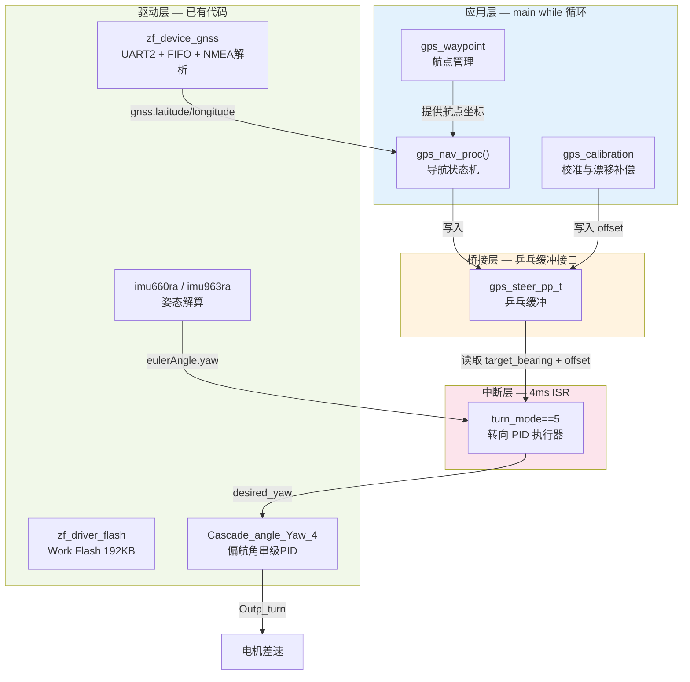
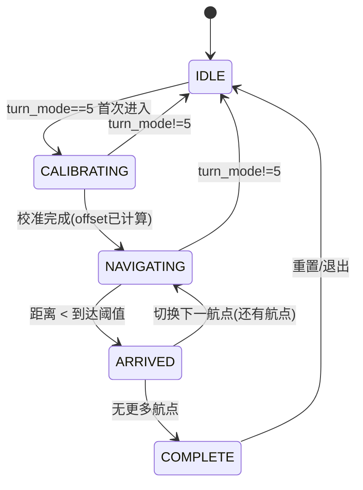
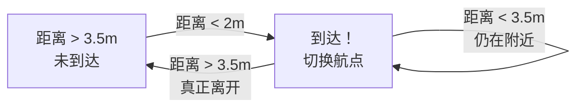
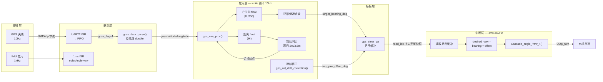
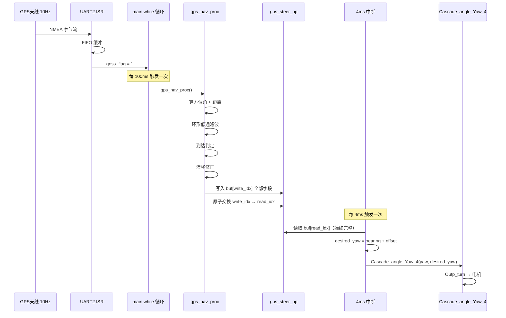

# ARCHITECTURE — GPS 导航框架

> 6A 流程 · Architect 阶段产出
> 依赖文档：`ALIGNMENT_GPS_NAVIGATION.md`

---

## 1. 系统架构图

### 1.1 分层架构



### 1.2 职责一句话总结

| 层 | 职责 | 不做什么 |
|----|------|---------|
| 应用层 | 算"去哪"——导航状态机、航点管理、校准 | 不直接操作电机、不执行 PID |
| 桥接层 | 安全传递数据——乒乓缓冲指针交换 | 不做任何计算 |
| 中断层 | 执行"怎么转"——250Hz PID 闭环 | 不做导航计算、不访问 Flash |
| 驱动层 | 提供传感器数据和硬件抽象 | 不含导航逻辑 |

---

## 2. 模块设计

### 2.1 模块总览

| 模块 | 文件 | 职责 | 依赖 |
|------|------|------|------|
| 航点管理 | `gps_waypoint.h/c` | 航点 CRUD + Flash 读写 | Flash 驱动 |
| 导航状态机 | `gps_nav.h/c` | 状态机 + 方位角/距离计算 + 到达判定 + 环形滤波 | gnss 驱动, gps_waypoint |
| 校准与补偿 | `gps_calibration.h/c` | IMU-GPS 偏移校准 + GPS 方向漂移修正 | IMU, gnss |
| ISR 接口 | `Interrupt.c/h`（修改） | 双缓冲读取 + desired_yaw 计算 | gps_nav 输出 |

### 2.2 模块详细设计

#### M1: gps_waypoint — 航点管理

```
职责边界：
  ✓ 航点的增删改查（CRUD）
  ✓ Flash 持久化存储（页 50/51）
  ✓ 开机自动加载
  ✓ 航点有效性校验（经纬度范围、魔数校验）
  ✗ 不做导航计算
  ✗ 不做到达判定
```

**数据结构：**

```c
// 单个航点
typedef struct {
    double latitude;       // 纬度（十进制度）
    double longitude;      // 经度（十进制度）
} gps_waypoint_t;

// 航点集合（内存中的工作副本）
typedef struct {
    gps_waypoint_t waypoints[GPS_WP_MAX_COUNT];  // 最多 40 个
    uint8 count;                                   // 实际航点数
    uint8 current_index;                           // 当前目标航点索引
    uint8 valid;                                   // 数据有效标志（魔数校验）
} gps_waypoint_set_t;
```

**Flash 布局：**

| 页 | 内容 | 大小 | 说明 |
|----|------|------|------|
| 50 | 航点数据 | 2KB | 40 × 2×double(8B) = 640B，剩余校验/预留 |
| 51 | 元数据 | 2KB | count, current_index, magic, checksum |

**关键约束：**
- Flash 写入前必须先擦除整页
- 航点保存时：先写页 50（数据），再写页 51（元数据）
- 航点加载时：先校验页 51（元数据），再读页 50（数据）
- double 在 Flash 中通过 `flash_data_union` 拆为 2 个 uint32 存储（参考 Ins.c 的 `writeDoubleToFlash1`）

---

#### M2: gps_nav — 导航状态机

```
职责边界：
  ✓ 导航状态机（IDLE → CALIBRATING → NAVIGATING → ARRIVED → COMPLETE）
  ✓ 方位角计算（调用 get_two_points_azimuth）
  ✓ 距离计算（调用 get_two_points_distance）
  ✓ 到达判定（滞后阈值：2m 进入 / 3.5m 离开）
  ✓ 环形低通滤波（防止 ±180° 边界跳变）
  ✓ 写入双缓冲输出结构体
  ✗ 不直接操作电机
  ✗ 不访问 Flash（通过 gps_waypoint 模块）
  ✗ 不执行 PID
```

**状态机：**



**状态说明：**

| 状态 | 触发条件 | 执行动作 | 退出条件 |
|------|---------|---------|---------|
| IDLE | 初始状态 / turn_mode≠5 | 不输出转向 | turn_mode==5 |
| CALIBRATING | 首次进入 turn_mode==5 | 计算偏移量 offset | offset 计算完成 |
| NAVIGATING | 校准完成 / 切换航点后 | 算方位角+距离+滤波→写乒乓缓冲 | 到达当前航点 |
| ARRIVED | 距离 < 到达阈值 | 切换 current_index++ | 还有航点→NAVIGATING；无→COMPLETE |
| COMPLETE | 所有航点走完 | turn_mode=0，停车 | 手动重置 |

**乒乓缓冲输出结构体：**

```c
// 单个转向输出快照（无 data_ready 标志，由指针交换保证一致性）
typedef struct {
    float target_bearing_deg;      // 目标方位角 [0, 360)，已滤波
    float distance_to_wp_m;        // 到目标航点距离（米）
    float imu_yaw_offset_deg;      // IMU-GPS 航向偏移量
} gps_steer_output_t;

// 乒乓缓冲管理器
typedef struct {
    gps_steer_output_t buf[2];     // 双缓冲区
    volatile uint8 write_idx;      // 写入侧索引（仅 main while 修改）
    volatile uint8 read_idx;       // 读取侧索引（仅 4ms ISR 读取）
} gps_steer_pp_t;
```

**乒乓缓冲原理：**
- `write_idx` 和 `read_idx` 始终互补（write_idx == 1 - read_idx）
- 写入方（main while）始终向 `buf[write_idx]` 写入，写完后原子交换 `write_idx ↔ read_idx`
- 读取方（4ms ISR）始终从 `buf[read_idx]` 读取，不会读到半更新数据
- 指针交换是单次 volatile 写操作，天然原子，无需关中断

**环形低通滤波：**

```c
// 处理 ±180° 边界的低通滤波
// 普通滤波：lpf = (1-α)*lpf + α*new
// 环形滤波：先算最短弧度差，再加到 lpf 上
float angle_lpf_circular(float old_val, float new_val, float alpha) {
    float diff = new_val - old_val;
    // 归一化到 [-180, +180)
    if (diff > 180.0f)  diff -= 360.0f;
    if (diff < -180.0f) diff += 360.0f;
    return old_val + alpha * diff;  // 在最短弧度方向上滤波
}
```

**到达判定（滞后）：**



- 进入阈值：2m（判定到达）
- 离开阈值：3.5m（防止在航点附近反复切换）

---

#### M3: gps_calibration — 校准与漂移补偿

```
职责边界：
  ✓ 起点校准：计算 IMU yaw 与 GPS 方位角的偏移量
  ✓ 行驶中漂移修正：用 gnss.direction 周期性修正 offset
  ✓ 低速/静止时不修正（GPS 方向不可靠）
  ✗ 不做航点管理
  ✗ 不做导航计算
```

**校准流程（起点约束法）：**

```
前提：机器人停在第一个航点，面朝第二个航点方向

1. 读取当前 IMU yaw → imu_yaw_at_start
2. 计算航点1→航点2 的 GPS 方位角 → gps_bearing_start
3. offset = gps_bearing_start - imu_yaw_at_start
4. 将 offset 归一化到 [-180, +180)
5. 校准完成，写入 gps_steer_output_t.imu_yaw_offset_deg
```

**行驶中漂移修正：**

```c
// 条件：速度 > 5km/h 且 GPS 方向有效
// 方法：缓慢修正 offset，使 IMU yaw 逼近 GPS 方向
if (gnss.speed > 5.0f && gnss.state == 1) {
    float gps_heading = gnss.direction;           // GPS 运动方向 [0, 360)
    float imu_heading = imu660ra.eulerAngle.yaw;  // IMU 当前偏航 [-180, +180)
    float error = angle_diff_circular(gps_heading, imu_heading + offset);
    offset += error * GPS_DRIFT_CORRECTION_ALPHA;  // 很小的 α，缓慢修正
}
```

**关键参数：**

| 参数 | 默认值 | 说明 |
|------|--------|------|
| GPS_DRIFT_CORRECTION_ALPHA | 0.02 | 漂移修正速率（每 100ms 修正 2%） |
| GPS_DRIFT_MIN_SPEED_KMH | 5.0 | 低于此速度不修正（GPS 方向不可靠） |
| GPS_DRIFT_MAX_ERROR_DEG | 30.0 | 误差超过此值不修正（可能是多径效应） |

---

#### M4: ISR 接口层 — Interrupt.c/h 修改

```
职责边界：
  ✓ 从乒乓缓冲读取 target_bearing + offset
  ✓ 计算 desired_yaw
  ✓ 调用 Cascade_angle_Yaw_4 执行 PID
  ✗ 不做任何导航计算
  ✗ 不访问 Flash
  ✗ 不调用 gnss_data_parse
```

**修改点：**

| 文件 | 修改内容 |
|------|---------|
| `Interrupt.h` | 删除旧的 `steer_gps_target_bearing_deg` 等 3 个 volatile 变量声明，改为 `#include "gps_nav.h"` |
| `Interrupt.c` turn_mode==5 | 从直接读 volatile 变量改为读乒乓缓冲 `gps_steer_pp.buf[read_idx]` |

**修改后的 turn_mode==5 代码逻辑：**

```c
else if (turn_mode == 5)
{
    const gps_steer_output_t *steer = &gps_steer_pp.buf[gps_steer_pp.read_idx];
    desired_yaw = steer->target_bearing_deg + steer->imu_yaw_offset_deg;
    Yao.Outp_turn = Cascade_angle_Yaw_4(
        &PID_all.Pid_turn2, erect_Angle_Yaw_3,
        imu660ra.eulerAngle.yaw, desired_yaw);
    Yao.Outp_turn = limit(Yao.Outp_turn, 8000.0f);
}
```

---

## 3. 接口契约定义

### 3.1 gps_waypoint.h

| 函数 | 签名 | 前置条件 | 后置条件 | 耗时 |
|------|------|---------|---------|------|
| 初始化 | `void gps_wp_init(void)` | Flash 驱动已初始化 | 从 Flash 加载航点到内存 | < 5ms |
| 保存到Flash | `uint8 gps_wp_save_to_flash(void)` | 内存中有航点数据 | 页 50/51 写入完成 | < 10ms |
| 添加航点 | `uint8 gps_wp_add(double lat, double lng)` | count < 40 | 新航点追加到末尾 | < 1μs |
| 清空航点 | `void gps_wp_clear(void)` | — | count=0, valid=0 | < 1μs |
| 获取当前航点 | `gps_waypoint_t* gps_wp_current(void)` | valid==1 | 返回 current_index 对应航点指针 | < 1μs |
| 获取下一航点 | `gps_waypoint_t* gps_wp_next(void)` | current_index+1 < count | 返回下一航点指针 | < 1μs |
| 切换到下一航点 | `uint8 gps_wp_advance(void)` | 还有下一航点 | current_index++ | < 1μs |
| 获取航点数 | `uint8 gps_wp_get_count(void)` | — | 返回 count | < 1μs |
| 获取当前索引 | `uint8 gps_wp_get_current_index(void)` | — | 返回 current_index | < 1μs |

**返回值约定：** `uint8` 类型返回 0=失败，1=成功。

---

### 3.2 gps_nav.h

| 函数 | 签名 | 前置条件 | 后置条件 | 耗时 |
|------|------|---------|---------|------|
| 初始化 | `void gps_nav_init(void)` | gnss + IMU 已初始化 | 状态=IDLE, 调用 gps_wp_init | < 5ms |
| 导航处理 | `void gps_nav_proc(void)` | gnss_flag==1 且 turn_mode==5 | 更新乒乓缓冲写入侧, 原子交换指针 | < 500μs |
| 获取状态 | `uint8 gps_nav_get_state(void)` | — | 返回当前状态枚举值 | < 1μs |
| 设置航点索引 | `uint8 gps_nav_set_wp_index(uint8 idx)` | idx < count | 切换目标航点 | < 1μs |
| 启动导航 | `void gps_nav_start(void)` | 航点有效 | turn_mode=5, 进入 CALIBRATING | < 1μs |
| 停止导航 | `void gps_nav_stop(void)` | — | turn_mode=0, 状态=IDLE | < 1μs |

**`gps_nav_proc()` 内部流程：**

```
gps_nav_proc()
  ├── 1. 读取 gnss.latitude / gnss.longitude
  ├── 2. 获取当前目标航点 gps_wp_current()
  ├── 3. 计算方位角 get_two_points_azimuth()
  ├── 4. 计算距离 get_two_points_distance()
  ├── 5. 环形低通滤波 angle_lpf_circular()
  ├── 6. 到达判定（滞后阈值）
  │     ├── 未到达 → 继续
  │     └── 到达 → gps_wp_advance() 或进入 COMPLETE
  ├── 7. 漂移修正（gps_calibration 模块）
  └── 8. 写入乒乓缓冲 buf[write_idx]，原子交换 write_idx ↔ read_idx
```

---

### 3.3 gps_calibration.h

| 函数 | 签名 | 前置条件 | 后置条件 | 耗时 |
|------|------|---------|---------|------|
| 起点校准 | `uint8 gps_cal_startpoint(void)` | 航点≥2, IMU 已初始化 | offset 计算完成 | < 100μs |
| 漂移修正 | `void gps_cal_drift_correction(void)` | 导航中, GPS 有效 | offset 缓慢修正 | < 50μs |
| 获取偏移量 | `float gps_cal_get_offset(void)` | — | 返回当前 offset | < 1μs |
| 重置偏移量 | `void gps_cal_reset(void)` | — | offset=0 | < 1μs |

---

### 3.4 乒乓缓冲接口（gps_nav.h 中定义）

```c
extern gps_steer_pp_t gps_steer_pp;  // 全局实例

// 写入方：gps_nav_proc()（main while 循环，10Hz）
// 读取方：Interrupt_4ms turn_mode==5（250Hz）
// 同步机制：指针交换（无锁乒乓缓冲）
//   - 写入方：向 buf[write_idx] 写入所有字段，然后原子交换 write_idx ↔ read_idx
//   - 读取方：从 buf[read_idx] 读取，每次调用都获取最新完整快照
//   - 单字节 volatile 读写在 ARM Cortex-M7 上天然原子，无需关中断
```

---

## 4. 数据流图

### 4.1 完整数据流



### 4.2 数据属性表

| 数据 | 类型 | 更新频率 | 生产者 | 消费者 | 存储位置 |
|------|------|---------|--------|--------|---------|
| gnss.latitude/longitude | double | 10Hz | gnss_data_parse | gps_nav_proc | gnss 结构体 |
| gnss.speed | float | 10Hz | gnss_data_parse | gps_cal_drift_correction | gnss 结构体 |
| gnss.direction | float | 10Hz | gnss_data_parse | gps_cal_drift_correction | gnss 结构体 |
| gnss.state | uint8 | 10Hz | gnss_data_parse | gps_nav_proc | gnss 结构体 |
| eulerAngle.yaw | float | 1kHz (1ms积分) | Interrupt_1ms | turn_mode==5 | imu660ra 结构体 |
| target_bearing_deg | float | 10Hz (滤波后) | gps_nav_proc | 4ms ISR | gps_steer_pp.buf |
| imu_yaw_offset_deg | float | 校准时1次/行驶中慢修正 | gps_calibration | 4ms ISR | gps_steer_pp.buf |
| distance_to_wp_m | float | 10Hz | gps_nav_proc | (调试用) | gps_steer_pp.buf |
| desired_yaw | float | 250Hz | 4ms ISR | Cascade_angle_Yaw_4 | Interrupt.c 局部 |
| Outp_turn | float | 250Hz | Cascade_angle_Yaw_4 | 电机驱动 | Yao 结构体 |

### 4.3 时序关系



---

## 5. 异常处理与安全策略

### 5.1 异常场景与应对

| # | 异常场景 | 检测方式 | 应对策略 | 恢复条件 |
|---|---------|---------|---------|---------|
| 1 | GPS 丢星 | `gnss.state != 1` | 保持上次方位角，不更新双缓冲；超时 5s 后停车 | GPS 恢复 state==1 |
| 2 | GPS 多径跳变 | 方位角单帧变化 > 30° | 环形低通滤波自动抑制；若连续 3 帧跳变则忽略 | 方位角恢复正常 |
| 3 | 航点 Flash 损坏 | 页 51 魔数/校验和不匹配 | 标记 valid=0，导航不启动，串口报错 | 重新采点写入 |
| 4 | IMU-GPS 偏移过大 | |offset| > 90° | 不启动导航，串口提示校准失败 | 重新校准 |
| 5 | 到达航点但无下一航点 | current_index >= count | 进入 COMPLETE 状态，turn_mode=0 停车 | 手动重置 |
| 6 | desired_yaw 读写竞争 | 乒乓缓冲指针交换 | ISR 只读 buf[read_idx]，写入方只写 buf[write_idx]，天然隔离 | — |
| 7 | ±180° 边界跳变 | 环形低通滤波 | 在最短弧度方向上平滑过渡 | — |
| 8 | 导航中 turn_mode 被外部改变 | turn_mode != 5 | 状态机回到 IDLE | turn_mode 重新设为 5 |
| 9 | 机器人倾倒 | 俯仰/翻滚角超限（已有保护） | 电机停止（已有逻辑） | 人工扶正 |
| 10 | GPS 速度异常 | gnss.speed > 100 km/h | 忽略该帧数据 | 速度恢复正常 |

### 5.2 安全优先级

```
最高 → 电机停止（倾倒/超速保护，已有逻辑）
      → 导航停止（turn_mode=0，COMPLETE/异常时触发）
      → 保持上次值（GPS 丢星/读写竞争时）
最低 → 降级运行（漂移修正暂停，低速时不修正）
```

### 5.3 防御性编程要点

1. **所有 float 比较**：使用阈值范围，不用 `==`
2. **Flash 操作**：写入后回读校验
3. **数组越界**：current_index 严格 < count
4. **除零保护**：距离为 0 时方位角无意义，直接判定到达
5. **状态一致性**：任何异常退出都确保 turn_mode 和状态机同步

---

## 6. 文件结构

```
project/code/GpsNav/
├── gps_nav.h              # 导航状态机 + 乒乓缓冲接口
├── gps_nav.c              # 导航状态机实现
├── gps_waypoint.h         # 航点管理接口
├── gps_waypoint.c         # 航点管理 + Flash 读写实现
├── gps_calibration.h      # 校准与漂移补偿接口
└── gps_calibration.c      # 校准与漂移补偿实现

修改的已有文件：
├── project/code/ControlPart/Init.c        # 取消注释 gnss_init() + 添加 gps_nav_init()
├── project/code/ControlPart/Interrupt.h   # 删除旧 GPS volatile 变量，添加 #include "gps_nav.h"
└── project/code/ControlPart/Interrupt.c   # turn_mode==5 改为读乒乓缓冲
```

---

## 7. 关键设计决策记录

| 决策 | 选项 | 选择 | 理由 |
|------|------|------|------|
| 导航计算位置 | A. 4ms ISR / B. main while | **B** | ISR 中做重计算会阻塞其他中断；Flash 操作 1-5ms 超出 4ms 周期 |
| 数据同步机制 | A. 关中断 / B. 双缓冲+标志 / C. 互斥锁 / D. 乒乓缓冲 | **D** | 嵌入式无 OS 不支持互斥锁；关中断影响控制精度；双缓冲+标志可能读到半更新数据；乒乓缓冲通过指针交换保证原子性，无需关中断 |
| 方位角滤波 | A. 无滤波 / B. 普通LPF / C. 环形LPF | **C** | ±180° 边界处普通 LPF 会走远路（179°→-179° 差 2° 但普通 LPF 算 358°） |
| 到达判定 | A. 单一阈值 / B. 滞后阈值 | **B** | 单一阈值在航点附近会反复触发切换；滞后避免抖动 |
| 校准方式 | A. 运动方向法 / B. 起点约束法 | **B** | 运动方向法需要 GPS 速度>5km/h 才有效；起点约束法开机即可校准 |
| 漂移修正 | A. 不修正 / B. GPS 方向修正 | **B** | IMU 陀螺仪漂移 5 分钟后可达 5-10°，必须修正 |
| Flash 分区 | A. 与 Ins.c 共享 / B. 独立页 50/51 | **B** | 避免与现有 Ins.c（页 0/10）和 ins_track（页 26-49）冲突 |

---

## 8. 与现有代码的集成点

| 集成点 | 现有代码 | 修改内容 | 风险 |
|--------|---------|---------|------|
| gnss_init() | Init.c 第 88/100 行被注释 | 取消注释 | 低 — 仅启用已有驱动 |
| turn_mode==5 | Interrupt.c 第 676 行 | 改为读乒乓缓冲 buf[read_idx] | 低 — 仅改读取方式，时序天然安全 |
| GPS volatile 变量 | Interrupt.h 中声明 | 删除旧声明，改为 include gps_nav.h | 低 — 纯接口替换 |
| main while 循环 | main_cm7_1.c（CM7_0 主循环） | 添加 gnss_flag 门控 + gps_nav_proc() 调用 | 低 — 新增代码，不修改已有逻辑 |
| cm7_1_isr.c | uart2_isr 已调用 gnss_uart_callback | 无需修改 | 无 — 已正确配置 |
