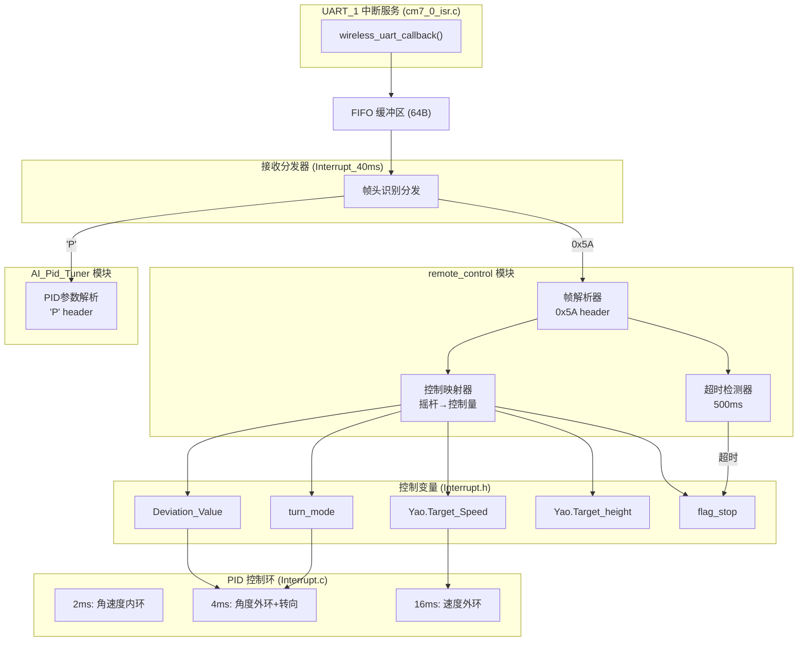
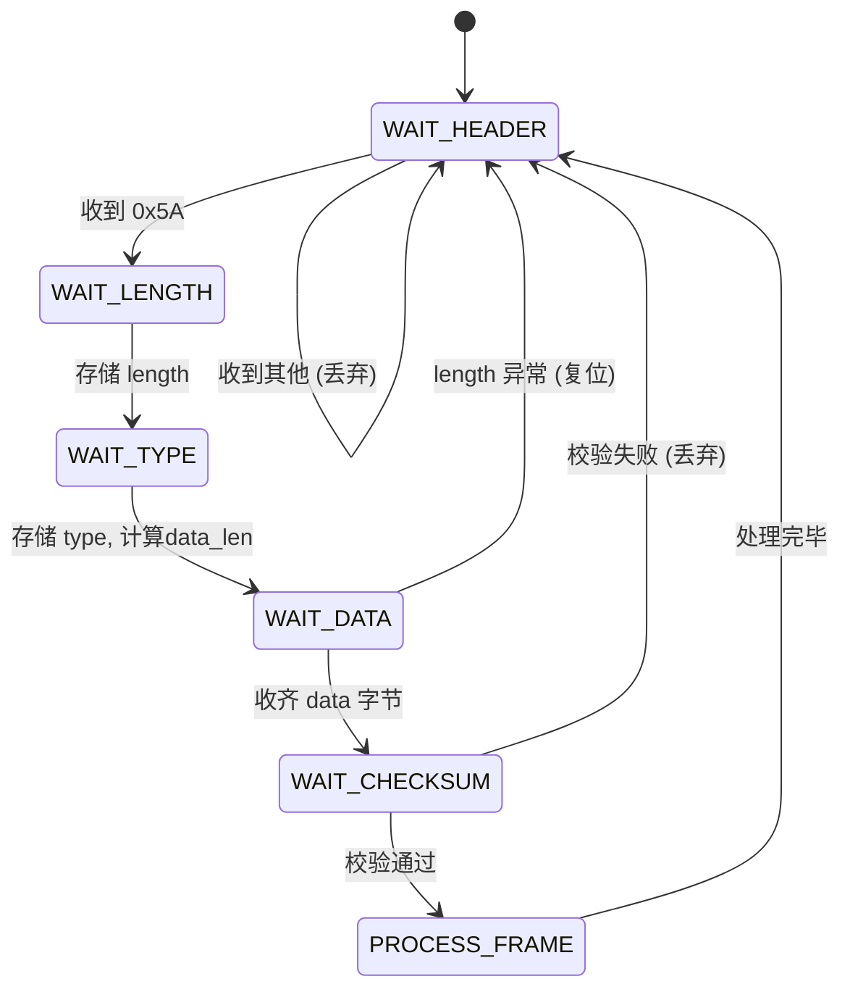
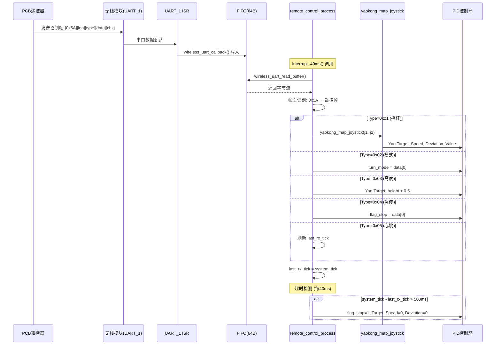
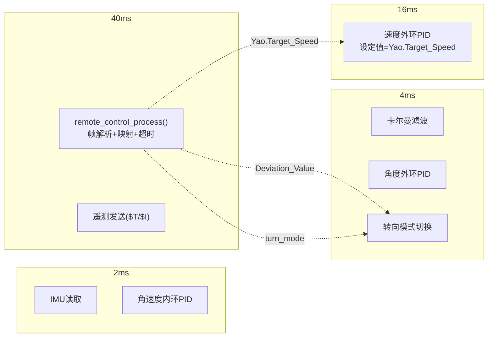

# ARCHITECTURE — 遥控器功能开发

## 1. 系统架构总览



## 2. 模块设计

### 2.1 新增模块: `remote_control.c/h`

**职责**: 遥控协议解析、超时安全检测、摇杆→控制量映射

**数据结构**:
```c
typedef struct {
    int16_t  joystick[4];       /* 原始摇杆值 (来自遥控帧) */
    uint8_t  active;            /* 遥控激活标志: 1=在超时窗口内, 0=超时 */
    uint32_t last_rx_tick;      /* 最后收到帧的系统tick (ms) */
    uint8_t  emergency_stop;    /* 急停请求: 1=急停, 0=正常 */
    uint8_t  frame_count;       /* 帧计数器 (调试用) */
} RemoteControl_t;
```

**帧解析状态机**:


**API 接口**:

| 函数 | 原型 | 调用位置 | 说明 |
|------|------|---------|------|
| 初始化 | `void remote_control_init(void)` | `Init.c` | 清零状态，复位解析器 |
| 处理接收 | `void remote_control_process(void)` | `Interrupt_40ms()` | 读FIFO→帧头分发→解析→映射 |
| 查询激活 | `uint8_t remote_control_is_active(void)` | `Interrupt_16ms()` | 超时窗口内返回1 |
| 获取数据 | `RemoteControl_t* remote_control_get_data(void)` | 调试用 | 返回内部状态指针 |

### 2.2 修改模块: `yaokong.c/h`

**修改内容**:
1. **修复双return bug**: 删除 `return 0;` 死代码
2. **解耦LoRa依赖**: 将 `lora3a22_uart_transfer.joystick[]` 替换为参数传入
3. **新接口**:
```c
/* 摇杆值 → 控制量映射 (从 yaokong_data_deal 重构) */
void yaokong_map_joystick(int16_t joystick_1, int16_t joystick_2);
```
4. **映射逻辑保留** (与原 yaokong_data_deal 一致):
   - `joystick_1 > 200` → `Yao.Target_Speed = 1000` (满速前进)
   - `joystick_1 < -200` → `Yao.Target_Speed = 0.2 * joystick_1` (比例减速/后退)
   - `|joystick_1| ≤ 200` → `Yao.Target_Speed = 0` (死区)
   - `|joystick_2| > 100` → `Deviation_Value = -joystick_2 / 1800.0` (转向)
   - `|joystick_2| ≤ 100` → `Deviation_Value = 0` (死区)
   - `Deviation_Value` 限幅 ±1.0

### 2.3 修改模块: `Interrupt.c`

| 修改点 | 位置 | 变更 |
|--------|------|------|
| 遥控处理调用 | `Interrupt_40ms()` | 添加 `remote_control_process()` |
| 速度环设定值 | `Interrupt_16ms()` | 速度环设定值从硬编码0改为 `Yao.Target_Speed` (遥控激活时) |
| 超时安全 | `Interrupt_40ms()` | 遥控超时500ms → `flag_stop=1`, 清零控制量 |

### 2.4 修改模块: `main_cm7_0.c`

| 修改点 | 变更 |
|--------|------|
| 移除硬编码零值 | 删除 `Yao.Outp_Gyro_Pitch = 0; Yao.Outp_Angle_Pitch = 0; Yao.Outp_Speed_Pitch = 0;` |
| 包含头文件 | 添加 `#include "remote_control.h"` |

### 2.5 修改模块: `Init.c`

| 修改点 | 变更 |
|--------|------|
| 遥控初始化 | 添加 `remote_control_init()` 调用 |

## 3. 接口契约

### 3.1 UART_1 接收分发协议

```
wireless_uart_read_buffer() → 逐字节读取
    ├── 首字节 == 0x5A → remote_control 帧解析器
    ├── 首字节 == 'P'  → AI_Pid_Tuner 行解析器
    └── 其他           → 丢弃
```

**关键约束**: 
- `remote_control_process()` 先读FIFO，按帧头分发
- AI调参的 `AI_Pid_Tuner_ProcessRx()` 改为被 `remote_control_process()` 内部调用（当检测到 'P' 开头时）
- 遥控帧优先级高于AI调参（物理互斥保证不会同时到达）

### 3.2 遥控帧协议 (二进制)

```
[0x5A] [len] [type] [data...] [checksum]
```

| 字段 | 偏移 | 长度 | 说明 |
|------|------|------|------|
| Header | 0 | 1B | 固定 0x5A |
| Length | 1 | 1B | 帧总长度 (含header和checksum) |
| Type | 2 | 1B | 命令类型 |
| Data | 3 | 变长 | 命令数据 |
| Checksum | len-1 | 1B | 前(len-1)字节XOR |

**Type 定义与 Data 格式**:

| Type | 名称 | Data长度 | Data格式 | 控制输出 |
|------|------|---------|---------|---------|
| 0x01 | 摇杆数据 | 8B | 4×int16 (大端) | → yaokong_map_joystick(j1, j2) |
| 0x02 | 模式切换 | 1B | uint8 turn_mode | → turn_mode (仅允许0/2/3/6) |
| 0x03 | 高度调节 | 1B | uint8 dir (0=保持,1=增,2=减) | → Yao.Target_height ±0.5cm |
| 0x04 | 急停控制 | 1B | uint8 stop (1=停,0=恢复) | → flag_stop |
| 0x05 | 心跳包 | 0B | 无 | → 刷新超时计时器 |

### 3.3 超时安全机制

```
每次收到有效遥控帧 → last_rx_tick = system_tick
Interrupt_40ms() 中检查:
    if (remote_control_is_active() && (system_tick - last_rx_tick > 500))
        → flag_stop = 1
        → Yao.Target_Speed = 0
        → Deviation_Value = 0
        → active = 0
```

## 4. 数据流图



## 5. 中断调用时序



**调用顺序** (40ms中断内):
1. `remote_control_process()` — 先处理接收数据，更新控制量
2. 遥测发送 — 后发送调试数据（遥控器接入时无人接收，无影响）

## 6. 异常处理与安全

| 异常场景 | 检测方式 | 处理策略 | 恢复条件 |
|---------|---------|---------|---------|
| 帧校验错误 | XOR checksum ≠ 0 | 丢弃当前帧，复位解析器 | 下一帧自动恢复 |
| 帧长度异常 | length < 4 或 > 32 | 丢弃，复位解析器 | 下一帧自动恢复 |
| 解析器溢出 | data字节超过预期 | 复位到 WAIT_HEADER | 下一帧自动恢复 |
| 遥控信号丢失 | 500ms无有效帧 | flag_stop=1, 清零控制量 | 收到新帧 → flag_stop=0 |
| 急停命令 | Type=0x04, data=1 | 立即 flag_stop=1 | Type=0x04, data=0 |
| 无效turn_mode | data ∉ {0,2,3,6} | 忽略，保持当前模式 | — |
| FIFO溢出 | wireless_uart FIFO满 | 旧数据被覆盖，帧可能损坏 | 校验失败→丢弃→下一帧恢复 |
| 遥控器断电 | 等同信号丢失 | 500ms超时→自动停车 | 重新上电+发送帧 |

## 7. 与现有代码的集成点

| 集成点 | 文件 | 现有代码 | 遥控集成方式 |
|--------|------|---------|-------------|
| UART_1 接收 | `cm7_0_isr.c` | `wireless_module_uart_handler()` | **不修改**，ISR已正确写入FIFO |
| FIFO 读取 | `AI_Pid_Tuner.c` | `wireless_uart_read_buffer()` | 改由 `remote_control_process()` 统一读取分发 |
| 速度环设定值 | `Interrupt.c` 16ms | 硬编码 `Yao.Target_Speed=0` | 改为遥控驱动的 `Yao.Target_Speed` |
| 转向偏差 | `Interrupt.c` 4ms | `Deviation_Value` 由各模式设置 | 遥控激活时由 `yaokong_map_joystick()` 设置 |
| 主循环输出 | `main_cm7_0.c` | 硬编码零值 | 删除硬编码，由PID环自然输出 |
| 遥测发送 | `Interrupt.c` 40ms | `wireless_uart_send_string()` | **不修改**，始终发送（物理互斥无冲突） |

## 8. 文件变更清单

| 操作 | 文件路径 | 变更说明 |
|------|---------|---------|
| **新建** | `project/code/ControlPart/remote_control.c` | 遥控协议解析+超时检测+控制映射 |
| **新建** | `project/code/ControlPart/remote_control.h` | 遥控模块头文件 |
| **修改** | `project/code/ControlPart/yaokong.c` | 修复bug，解耦LoRa，新接口 |
| **修改** | `project/code/ControlPart/yaokong.h` | 新接口声明 |
| **修改** | `project/code/ControlPart/Interrupt.c` | 40ms添加遥控处理，16ms速度环接入 |
| **修改** | `project/code/ControlPart/Init.c` | 添加 `remote_control_init()` |
| **修改** | `project/user/main_cm7_0.c` | 移除硬编码零值，包含头文件 |
| **新建** | `tools/remote_control_test.py` | Python上位机测试脚本 |
