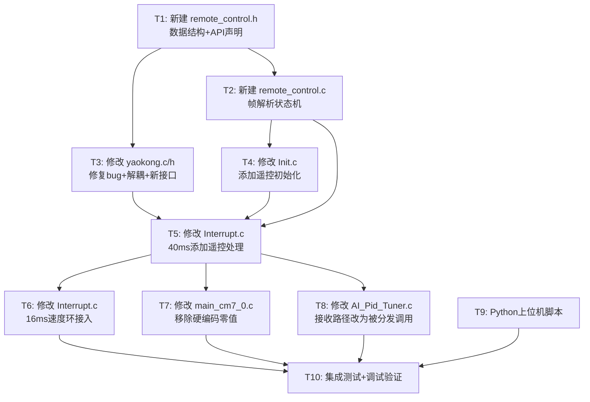

# TASKS — 遥控器功能开发

## 任务依赖图

## 任务清单

### T1: 新建 remote_control.h — 数据结构+API声明
- **ID**: T1
- **输入**: ARCHITECTURE 文档中的接口定义
- **输出**: `project/code/ControlPart/remote_control.h`
- **内容**:
  - `RemoteControl_t` 结构体定义 (joystick[4], active, last_rx_tick, emergency_stop, frame_count)
  - 帧协议常量定义 (HEADER=0x5A, Type枚举, 超时阈值)
  - 解析器状态枚举 (WAIT_HEADER, WAIT_LENGTH, WAIT_TYPE, WAIT_DATA, WAIT_CHECKSUM)
  - API声明: `remote_control_init()`, `remote_control_process()`, `remote_control_is_active()`, `remote_control_get_data()`
- **依赖**: 无
- **完成标准**: 头文件编译无错误，结构体和函数声明完整
- **复杂度**: 低

### T2: 新建 remote_control.c — 帧解析状态机+控制映射
- **ID**: T2
- **输入**: T1 的头文件, ARCHITECTURE 中的帧协议和状态机设计
- **输出**: `project/code/ControlPart/remote_control.c`
- **内容**:
  - `remote_control_init()`: 清零 RemoteControl_t, 复位解析器状态
  - `remote_control_process()`: 核心函数
    - 从 `wireless_uart_read_buffer()` 逐字节读取
    - 帧头识别分发: 0x5A→遥控帧解析, 'P'→调用 `AI_Pid_Tuner_ProcessRx()`
    - 状态机解析: WAIT_HEADER → WAIT_LENGTH → WAIT_TYPE → WAIT_DATA → WAIT_CHECKSUM
    - 校验: XOR checksum
    - 帧处理: 按 Type 分发到各处理函数
    - 超时检测: 500ms 无帧 → flag_stop=1, 清零控制量
  - 各 Type 处理函数:
    - `rc_handle_joystick()`: 存储摇杆值, 调用 `yaokong_map_joystick()`
    - `rc_handle_mode_switch()`: 校验 turn_mode ∈ {0,2,3,6}, 更新 turn_mode
    - `rc_handle_height()`: Yao.Target_height ± 0.5cm
    - `rc_handle_emergency()`: 设置 flag_stop
    - `rc_handle_heartbeat()`: 刷新 last_rx_tick
  - `remote_control_is_active()`: 返回 active 标志
  - `remote_control_get_data()`: 返回内部状态指针
- **依赖**: T1
- **完成标准**: 帧解析状态机逻辑完整，所有 Type 处理函数实现，超时检测实现
- **复杂度**: 高

### T3: 修改 yaokong.c/h — 修复bug+解耦LoRa+新接口
- **ID**: T3
- **输入**: 现有 yaokong.c/h 代码
- **输出**: 修改后的 `project/code/ControlPart/yaokong.c` 和 `yaokong.h`
- **内容**:
  - **修复**: 删除 `return 0;` 死代码 (第46行)
  - **解耦**: 将 `lora3a22_uart_transfer.joystick[]` 替换为函数参数
  - **新接口**: `void yaokong_map_joystick(int16_t joystick_1, int16_t joystick_2)`
  - **保留映射逻辑**: 死区±200/±100, 速度满值1000, 转向限幅±1.0
  - **yaokong.h**: 更新声明，移除 `extern int velocity;` (未使用)
- **依赖**: T1 (需要 remote_control.h 中的控制变量声明)
- **完成标准**: 编译无错误，映射逻辑与原 yaokong_data_deal 一致
- **复杂度**: 低

### T4: 修改 Init.c — 添加遥控初始化
- **ID**: T4
- **输入**: T2 的 `remote_control_init()` 函数
- **输出**: 修改后的 `project/code/ControlPart/Init.c`
- **内容**:
  - 添加 `#include "remote_control.h"`
  - 在 `Init_All()` 中调用 `remote_control_init()` (在 `wireless_uart_init()` 之后)
- **依赖**: T2
- **完成标准**: 编译无错误，初始化顺序正确
- **复杂度**: 低

### T5: 修改 Interrupt.c — 40ms中断添加遥控处理
- **ID**: T5
- **输入**: T2 的 `remote_control_process()` 函数
- **输出**: 修改后的 `project/code/ControlPart/Interrupt.c`
- **内容**:
  - 添加 `#include "remote_control.h"`
  - 在 `Interrupt_40ms()` 开头调用 `remote_control_process()` (在遥测发送之前)
  - 确保 `remote_control_process()` 先于遥测发送执行
- **依赖**: T2, T3, T4
- **完成标准**: 编译无错误，40ms中断中遥控处理在遥测发送之前
- **复杂度**: 低

### T6: 修改 Interrupt.c — 16ms速度环接入遥控设定值
- **ID**: T6
- **输入**: ARCHITECTURE 中的速度环设定值修改方案
- **输出**: 修改后的 `project/code/ControlPart/Interrupt.c`
- **内容**:
  - 在 `Interrupt_16ms()` 速度环计算中:
    - 当 `remote_control_is_active()` 为真时，速度环设定值使用 `Yao.Target_Speed` (由遥控映射设置)
    - 当遥控未激活时，速度环设定值保持 0 (平衡模式)
  - 注意: 不修改PID计算逻辑本身，只修改设定值来源
- **依赖**: T5 (需要 remote_control_is_active() 可用)
- **完成标准**: 遥控激活时速度环响应摇杆输入，未激活时保持平衡
- **复杂度**: 中

### T7: 修改 main_cm7_0.c — 移除硬编码零值
- **ID**: T7
- **输入**: 现有 main_cm7_0.c 代码
- **输出**: 修改后的 `project/user/main_cm7_0.c`
- **内容**:
  - 删除 `Yao.Outp_Gyro_Pitch = 0;`
  - 删除 `Yao.Outp_Angle_Pitch = 0;`
  - 删除 `Yao.Outp_Speed_Pitch = 0;`
  - 添加 `#include "remote_control.h"`
  - 保留安全检查逻辑 (速度>3000 或 角速度>7000 → flag_stop=1)
- **依赖**: T5 (确保遥控模块已初始化)
- **完成标准**: 编译无错误，PID输出不再被强制清零
- **复杂度**: 低

### T8: 修改 AI_Pid_Tuner.c — 接收路径改为被分发调用
- **ID**: T8
- **输入**: 现有 AI_Pid_Tuner.c 代码, T2 的分发逻辑
- **输出**: 修改后的 `project/code/ControlPart/AI_Pid_Tuner.c`
- **内容**:
  - 修改 `AI_Pid_Tuner_ProcessRx()` 的调用方式:
    - 原方式: 在 `Interrupt_40ms()` 中直接调用，自行读取 FIFO
    - 新方式: 由 `remote_control_process()` 检测到 'P' 开头时调用
  - 需要调整: `AI_Pid_Tuner_ProcessRx()` 不再自行从 FIFO 读取首字节 'P'
    - 方案A: 将首字节 'P' 作为参数传入
    - 方案B: 在 `remote_control_process()` 中将 'P' 放回某种缓冲
    - **选择方案A**: 修改 `AI_Pid_Tuner_ProcessRx(uint8_t first_byte)` 接口
  - 在 `Interrupt_40ms()` 中移除对 `AI_Pid_Tuner_ProcessRx()` 的直接调用
- **依赖**: T5 (需要 remote_control_process() 已实现分发)
- **完成标准**: AI调参功能通过遥控模块分发调用，不再直接读FIFO
- **复杂度**: 中

### T9: Python上位机测试脚本
- **ID**: T9
- **输入**: ARCHITECTURE 中的帧协议定义
- **输出**: `tools/remote_control_test.py`
- **内容**:
  - 串口连接配置 (COM口, 115200)
  - 帧构建函数: `build_frame(type, data)` → 返回完整二进制帧
  - 摇杆控制: 键盘 WASD 映射到 joystick 值
  - 模式切换: 数字键 0/2/3/6 切换 turn_mode
  - 高度调节: Q/E 增减高度
  - 急停: Space 触发急停
  - 心跳: 自动每200ms发送心跳帧
  - 退出: ESC 退出并停车
- **依赖**: 无 (可与代码开发并行)
- **完成标准**: 脚本可运行，能正确构建和发送所有类型帧
- **复杂度**: 中

### T10: 集成测试+调试验证
- **ID**: T10
- **输入**: T1-T9 全部完成
- **输出**: 测试报告
- **内容**:
  - 编译通过，无错误无警告
  - 使用 Python 脚本发送各类型帧，验证:
    - 摇杆帧 → 机器人前后移动+转向
    - 模式切换帧 → turn_mode 正确切换
    - 高度调节帧 → 腿高变化
    - 急停帧 → 立即停车
    - 心跳帧 → 超时计时器刷新
  - 超时测试: 停止发送500ms → 自动停车
  - 松开摇杆 → 速度/转向归零
  - AI调参功能验证: 发送 'P:...' 格式数据 → PID参数更新
- **依赖**: T6, T7, T8, T9
- **完成标准**: 所有验收标准通过
- **复杂度**: 中

## 执行顺序 (MVP优先)

| 批次 | 任务 | 说明 |
|------|------|------|
| 1 | T1, T9 | 头文件声明 + Python脚本 (可并行) |
| 2 | T2, T3 | 核心实现 + yaokong修复 (可并行) |
| 3 | T4, T5 | 初始化 + 中断集成 |
| 4 | T6, T7, T8 | 速度环 + 主循环 + AI调参适配 |
| 5 | T10 | 集成测试 |
